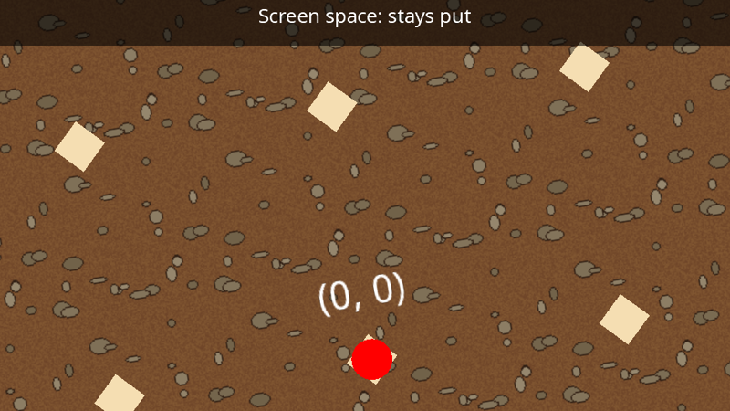

# Cameras

A camera decides which part of the 2D (or 3D) world ends up on a surface. Every time a draw stage is rendered, you choose the camera to render it through:

```csharp
q.Draw(drawStage, camera, windowRenderTarget);
```



## 2D cameras

Create a 2D camera ([ICamera2D](xref:Yak2D.ICamera2D)) in `CreateResources()`:

```csharp
_camera = yak.Cameras.CreateCamera2D(960, 540);        // virtual resolution; zoom defaults to 1
```

### Virtual resolution

The two numbers are the camera's **virtual resolution**: how many units it shows across and down at zoom 1. They are *not* pixels. Whatever the camera sees is stretched to fill the whole surface it is rendered onto (or the current [viewport](viewports.md)), whatever that surface's real size.

This makes your game resolution-independent. Design everything for, say, 960 x 540 units, and it fills a 960 x 540 window, a 1920 x 1080 window, or a full-screen 4K display in exactly the same way.

> [!TIP]
> Keep the camera's aspect ratio (width / height) the same as the surface's, or the picture will be squashed or stretched to fit. For a window that can be resized to any shape, either accept the stretching, or update the virtual resolution to match the window's aspect ratio when you receive `WindowWasResized`, using [SetCamera2DVirtualResolution()](xref:Yak2D.ICameras.SetCamera2DVirtualResolution*).

### Moving, zooming and rotating

A 2D camera has a **focus** (the world position in the middle of its view), a **zoom** and a **rotation**. Set them whenever you like, usually in `PreDrawing()`:

[!code-csharp[](../code/Snippets/TextAndCameras.cs#camera-move)]

| Method | Sets |
|---|---|
| [SetCamera2DFocusAndZoom](xref:Yak2D.ICameras.SetCamera2DFocusAndZoom*) | focus and zoom |
| [SetCamera2DRotation](xref:Yak2D.ICameras.SetCamera2DRotation*) | rotation, as an angle (radians, clockwise from "up") or as an "up" vector |
| [SetCamera2DFocusZoomAndRotation](xref:Yak2D.ICameras.SetCamera2DFocusZoomAndRotation*) | all three |
| [SetCamera2DVirtualResolution](xref:Yak2D.ICameras.SetCamera2DVirtualResolution*) | the virtual resolution |

The `Get...` methods ([GetCamera2DWorldFocus](xref:Yak2D.ICameras.GetCamera2DWorldFocus*), [GetCamera2DZoom](xref:Yak2D.ICameras.GetCamera2DZoom*), [GetCamera2DRotation](xref:Yak2D.ICameras.GetCamera2DRotation*), [GetCamera2DUp](xref:Yak2D.ICameras.GetCamera2DUp*), [GetCamera2DVirtualResolution](xref:Yak2D.ICameras.GetCamera2DVirtualResolution*)) read the current values back.

A zoom of 2 makes everything twice as big (so the camera sees half as much); 0.5 shows twice as much.

### World space and screen space

Every draw request says which space its positions are in:

- **World space** positions are transformed by the camera's focus, zoom and rotation. Use it for everything in the game world.
- **Screen space** positions ignore focus, zoom and rotation. (0, 0) is the middle of the view, and the edges are at plus and minus half the virtual resolution (for 960 x 540: x from -480 to 480, y from -270 to 270). Use it for HUDs, menus and backgrounds that must stay put.

Both have +Y pointing **up**.

[!code-csharp[](../code/Snippets/TextAndCameras.cs#camera-draw)]

Converting between world, screen and window (mouse) positions is covered in [Coordinate systems](coordinatesystems.md).

### Following a player

A common pattern is to ease the camera towards the player each frame rather than snapping to them, which feels smoother. From the [Yak Run tutorial](../tutorials/yakrun-3.md):

[!code-csharp[](../code/YakRun/Part4/Game.cs#predrawing)]

`1 - exp(-rate * seconds)` moves a fixed fraction of the remaining distance per second, whatever the frame rate.

### More than one camera

Cameras are cheap. Typical uses:

- A fixed **HUD camera** for screen-space text, so the HUD is unaffected by any zoom or shake applied to the game camera.
- **Parallax**: a background drawn through a camera that moves more slowly than the main one appears further away (see [Yak Run part 3](../tutorials/yakrun-3.md)).
- **Split screen**: two cameras rendering the same draw stage into different [viewports](viewports.md).
- A **mini-map**: the world drawn again, zoomed out, into a corner of the window.

## 3D cameras

A 3D camera ([ICamera3D](xref:Yak2D.ICamera3D)) is used by the [mesh render stage](mesh.md):

```csharp
_camera3D = yak.Cameras.CreateCamera3D(position: new Vector3(0, 0, 300),
                                       lookAt: Vector3.Zero,
                                       up: Vector3.UnitY,
                                       fieldOfViewDegress: 60.0f,
                                       aspectRatio: 16.0f / 9.0f,
                                       nearPlane: 1.0f,
                                       farPlane: 1000.0f);
```

Move it with [SetCamera3DView()](xref:Yak2D.ICameras.SetCamera3DView*) (position, look-at point and up direction) and change its lens with [SetCamera3DProjection()](xref:Yak2D.ICameras.SetCamera3DProjection*) (field of view in degrees, aspect ratio, near and far clipping distances). See [Coordinate systems](coordinatesystems.md#3d-rendering) for the 3D axes.

## Destroying cameras

Cameras are resources: destroy them with [DestroyCamera()](xref:Yak2D.ICameras.DestroyCamera*), or all at once with [DestroyAllCameras()](xref:Yak2D.ICameras.DestroyAllCameras), [DestroyAllCameras2D()](xref:Yak2D.ICameras.DestroyAllCameras2D) or [DestroyAllCameras3D()](xref:Yak2D.ICameras.DestroyAllCameras3D).

## See also

- Samples: [Draw_Camera2DWorldAndScreen](https://github.com/AlzPatz/yak2d-samples/tree/master/src/Draw_Camera2DWorldAndScreen) (a car driven round a map, with a following, rotating camera), [Draw_SplitScreenExample](https://github.com/AlzPatz/yak2d-samples/tree/master/src/Draw_SplitScreenExample)
- Full example code: [TextAndCameras.cs](https://github.com/AlzPatz/yak2d-docs-content/blob/master/code/Snippets/TextAndCameras.cs) (`CameraExample`)
