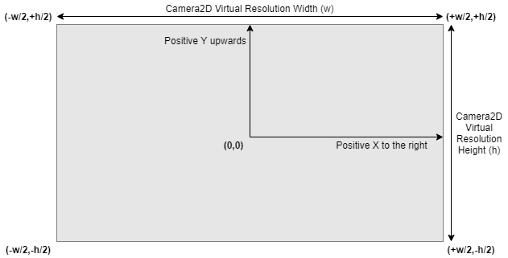
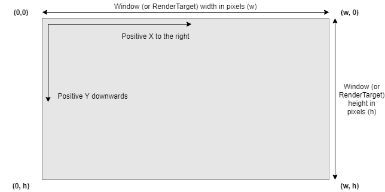

# **yak2D** Coordinate Systems and Rendering Resolution

## RenderStage Output

A RenderStage's output is render area size agnostic. This means that a [RenderStage](xref:uid_renderstages)'s output will fill the entire destination [render area](xref:uidglossary#RenderArea), which is either an entire [RenderTarget](xref:uid_rendertargets) or a rectangular area of one defined by a [viewport](xref:uid_viewports). 

The pixel size of the [render area](xref:uidglossary#RenderArea) does not matter. 

However, if the aspect ratio of the destination [render area](xref:uidglossary#RenderArea) does not match that of the [RenderStage](xref:uid_renderstages)'s output, the output will be distorted (stretched or squashed) to fit.

## Drawing

During [Drawing](xref:uid_glossary#Drawing), [DrawRequests](xref:Yak2D.DrawRequest) are submitted to, and rendered by, a [DrawStage](xref:Yak2D.IDrawStage). The final position of vertices upon the [render area](xref:uidglossary#RenderArea) is transformed by the assigned [Camera2D](xref:Yak2D.ICamera2D).

Each [Camera2D](xref:Yak2D.ICamera2D) has a [virtual resolution](xref:uid_glossary#VirtualResolution) that defines the boundaries of [screen space](xref:uid_coordinatesystems#screenspace) as well as [world space](xref:uid_coordinatesystems#worldspace) once a camera's zoom, world focus point and rotation are also accounted for.

## What this means in practice

A user can choose a [virtual resolution](xref:uid_glossary#VirtualResolution) and draw everything in relation to these effective screen dimensions, but it can be rendered at a final real resolution chosen simply by the an appropriately sized [render area](xref:uidglossary#RenderArea).  

## Coordinate Systems (***spaces***)

**yak2D** uses 3 coordinate systems (or ***spaces***) for 2D rendering:

1. [**Screen**](xref:uid_coordinatesystems#screen-space) space
2. [**World**](xref:uid_coordinatesystems#world-space) space
3. [**Window**](xref:uid_coordinatesystems#window-space) space

### **Screen Space**
The coordinate system used when drawing with [CoordinateSpace.Screen](xref:Yak2D.CoordinateSpace). Positions are defined in relation to a fixed visible area defined by the camera's [virtual resolution](xref:uid_glossary#VirtualResolution).

The origin (0,0) is located in the centre. Positive X-axis runs from left to right, with positive Y-axis running 'upwards' towards the top of the visible area.

Visible positions in screen space are defined by:

and...

where:
- w = [virtual resolution](xref:uid_glossary#VirtualResolution) width
- h = [virtual resolution](xref:uid_glossary#VirtualResolution) height

#### Screen Space Diagram

### **World Space**
The coordinate system used when drawing with [CoordinateSpace.World](xref:Yak2D.CoordinateSpace). Positions are defined in relation to an origin. The visible area is defined by the camera's world focus point (position) in relation to the origin, the camera's zoom scalar, rotation and [virtual resolution](xref:uid_glossary#VirtualResolution).

World space's axis are similar to screen space, in that when unrotated, positive X-axis runs from left to right, with positive Y-axis running 'upwards' towards the top of the visible area.

Therefore, if the camera's world focus point is (0,0), it's zoom is 1.0 and there is no camera rotation, then a position in world space will match a position in screen space.

### **Window Space**
Window space is used when defining [viewports](xref:uid_viewports) and is the coordinate system used for [mouse position](xref:Yak2D.Input.MousePosition).

The origin (0,0) of window space is positioned at the top-left corner of the window (or [Render Target](xref:uid_rendertargets)), with positive X-axis running from left to right, and positive Y-axis running 'downwards' towards the bottom of the window (or [Render Target](xref:uid_rendertargets)).

Window space units are absolute pixels.

Valid / visible pixel positions in window space are defined by:

and...

where:
- w = Window or [RenderTarget](xref:uid_rendertargets) width
- h = Window or [RenderTarget](xref:uid_rendertargets) height

#### Window Space Diagram

## Viewports
[Viewports](xref:uid_viewports) are used to define rectangular [render areas](xref:uidglossary#RenderArea) of a [RenderTarget](xref:uid_rendertargets). 

Viewport position and size are defined in pixel units and use [window space](xref:uid_coordinatesystems#window-space) axes.

## Texture Coordinates

**yak2D** texture coordinates are origin top-left and do not change across any graphics API backends. This is the same as used in Direct3D, Vulkan and Metal APIs, and is the same origin and axes directions as [window space](xref:uid_coordinatesystems#window-space).

**Note:** When writing shaders for a [CustomVeldrid](xref:Yak2D.ICustomVeldrid) [RenderStage](xref:uid_renderstages), the user is responsible for accounting for the backend differences between graphics APIs.

When writing shaders for a [CustomShader](xref:Yak2D.ICustomShader) [RenderStage](xref:uid_renderstages), the vertex shader provided ***already accounts for the differences*** in OpenGL texture coordinates. Therefore all shaders can be written assuming origin top-left.

## 3D Rendering

The [MeshRender](xref:Yak2D.IMeshRender) [RenderStage](xref:uid_renderstages) uses a [Camera3D](xref:Yak2D.ICamera3D) to manage the required view and projection matrices used during rendering. 

**yak2D** uses a Right-Handed coordinate system, which does not change across any graphics API backends. This coordinate system is positive-x towards the right, positive-y upwards and positive-z out of the screen, towards the camera.

**Note:** When writing shaders for a [CustomVeldrid](xref:Yak2D.ICustomVeldrid) [RenderStage](xref:uid_renderstages), the user is responsible for accounting for the backend differences between graphics APIs.

## Mouse Input
**yak2D** provides [mouse position](xref:Yak2D.Input.MousePosition) as a position on the application window, in [window space](xref:uid_coordinatesystems#window-space).

## Coordinate System Conversions

To easily convert positions between any of [screen space](xref:uid_coordinatesystems#screen-space), [world space](xref:uid_coordinatesystems#world-space) or [window space](xref:uid_coordinatesystems#window-space), **yak2D** provides [helper functions](xref:Yak2D.ICoordinateTransforms).
