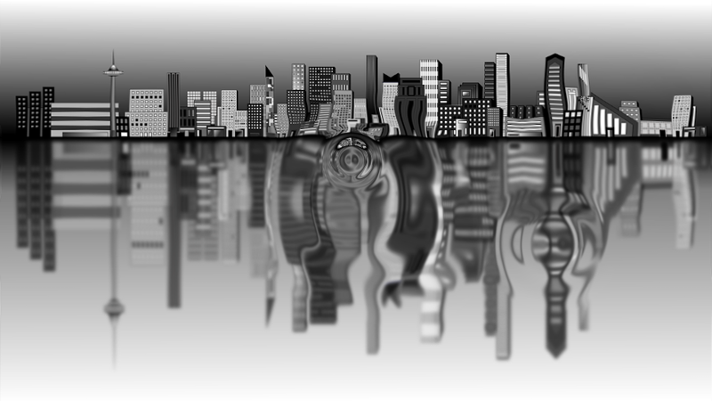

# Distortion

A distortion stage ([IDistortionStage](xref:Yak2D.IDistortionStage)) bends an image as if seen through water, heat haze or a lens. It makes ripples, shock waves, force fields and warping portals.



## How it works

A distortion stage is part draw stage, part effect:

1. Each frame you **draw a height map**: shapes and textures submitted to the stage, just like draw requests to a draw stage. Everything drawn adds up to make a landscape of "heights".
2. When the stage is rendered, each pixel of the source image is **shifted according to the slope** of the height map at that point, scaled by the stage's `DistortionScalar`.

Flat areas (including everywhere nothing was drawn) leave the image alone; steep slopes bend it strongly.

## Creating the stage

[!code-csharp[](../code/Snippets/Effects.cs#distortion-resources)]

[CreateDistortionStage()](xref:Yak2D.IStages.CreateDistortionStage*) takes the size of the internal height map surface (half the source size or less is usually plenty) and whether to clear the height map drawing at the start of each frame (`true` for anything that moves).

[DistortionEffectConfiguration](xref:Yak2D.DistortionEffectConfiguration)`.DistortionScalar` sets the overall strength.

## Drawing the height map

Height map drawing works exactly like [drawing](drawing.md), with [DrawDistortion()](xref:Yak2D.IDrawing.DrawDistortion*) and a [DistortionDrawRequest](xref:Yak2D.DistortionDrawRequest). There is no layer or depth (all height map drawing simply adds together), and there is an `Intensity` that scales the request's contribution instead.

The height of a pixel is its **red minus its green** (after multiplying the texture by the request's colour). So:

- A white or red texture or colour raises the height map; green lowers it.
- A single-channel `Float32` texture (as made by the helpers below) has only a red channel, so it always raises.

The easiest way to get a good height map is the built-in generator, which makes rings like ripples on water:

```csharp
var ring = yak.Helpers.DistortionHelper.TextureGenerator.ConcentricSinusoidalFloat32(
    256, 256,      // texture size
    8,             // number of quarter-waves from the centre to the edge
    true, true);   // fade the waves in towards the centre, and out towards the edge
```

[ConcentricSinusoidalRgba()](xref:Yak2D.IDistortionTextureGenerator.ConcentricSinusoidalRgba*) makes the same as an RGBA texture. For other shapes, make your own texture from data with [CreateFloat32FromData()](xref:Yak2D.ISurfaces.CreateFloat32FromData*) or [CreateRgbaFromData()](xref:Yak2D.ISurfaces.CreateRgbaFromData*), or use any image.

## Rendering

```csharp
q.Distortion(_distortion, _camera, source, target);
```

The camera positions the height map drawing, exactly as for a draw stage, so distortion drawn in world space lines up with the world as the camera moves. The source is usually a render target you have drawn your scene into.

## Animated ripples with a distortion collection

Growing, fading ripples are so common that there is a helper to manage them. A distortion collection ([IDistortionCollection](xref:Yak2D.IDistortionCollection)) holds any number of textured squares, each of which moves, grows, rotates and changes intensity over its lifetime:

[!code-csharp[](../code/Snippets/Effects.cs#distortion-update)]

[Add()](xref:Yak2D.IDistortionCollection.Add*) takes, in order: a [LifeCycle](xref:Yak2D.LifeCycle) (`Single` plays once and is removed; `LoopLinear` and `LoopReverse` repeat), the coordinate space, the duration in seconds, the texture, the start and end position, the start and end size, the start and end intensity, and the start and end rotation (in degrees). Call `Update()` to advance time and `Draw()` to submit everything to the stage each frame.

[Yak Run](../tutorials/yakrun-4.md) uses a collection to send a ripple out from every star the yak collects.

## See also

- Samples: [Distortion_ExampleUsingHelperFunctions](https://github.com/AlzPatz/yak2d-samples/tree/master/src/Distortion_ExampleUsingHelperFunctions) (click to make ripples in a pool), [Distortion_ManualTextureCreation](https://github.com/AlzPatz/yak2d-samples/tree/master/src/Distortion_ManualTextureCreation)
- Full example code: [Effects.cs](https://github.com/AlzPatz/yak2d-docs-content/blob/master/code/Snippets/Effects.cs) (`DistortionExample`)
