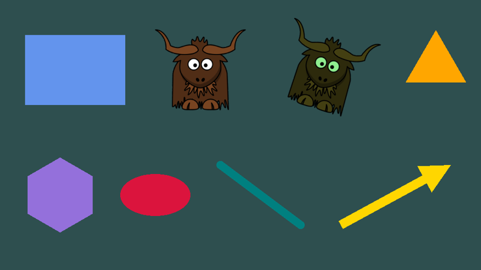
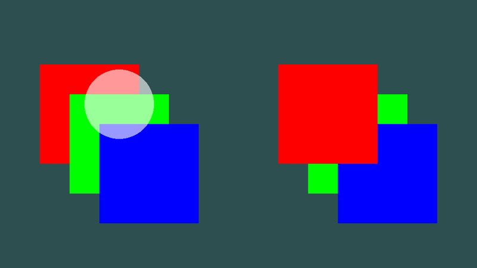
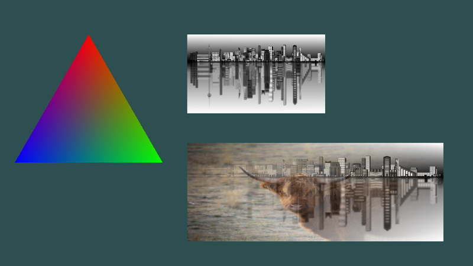
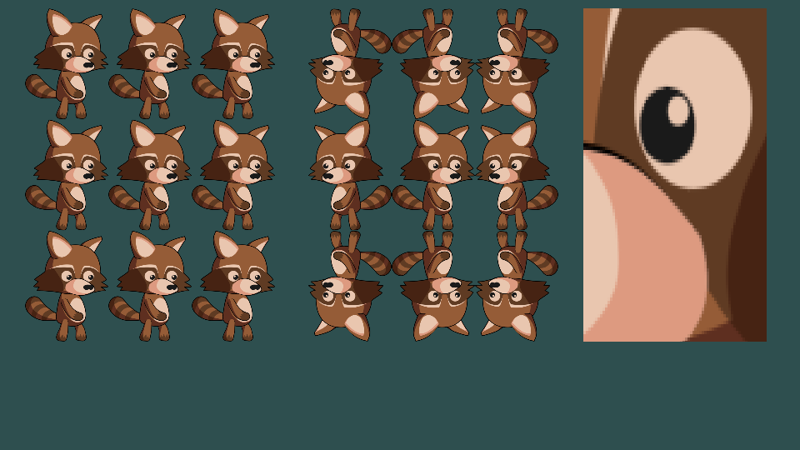
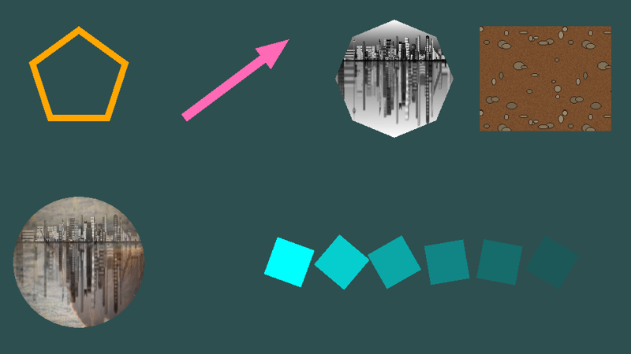

# Drawing

Everything 2D in yak2D (sprites, shapes, tiles, text) is drawn the same way: you submit **draw requests** to a **draw stage** in your [Drawing()](xref:Yak2D.IApplication.Drawing*) method, then render the draw stage through a camera in [Rendering()](xref:Yak2D.IApplication.Rendering*).



## Draw stages

A draw stage ([IDrawStage](xref:Yak2D.IDrawStage)) collects draw requests, sorts them, batches them together, and renders them. Create one in `CreateResources()`, along with a camera to view it through:

[!code-csharp[](../code/Snippets/Drawing.cs#basics-resources)]

[CreateDrawStage()](xref:Yak2D.IStages.CreateDrawStage*) has two optional parameters:

- **clearDynamicRequestQueueEachFrame** (default `true`): the stage starts every frame empty, so you draw everything each frame. Set it to `false` to keep requests between frames (see [Drawing things once](#drawing-things-once)).
- **blendState** (default `BlendState.Alpha`): how drawn pixels combine with what is already there (see [Blend states](#blend-states)).

Most games need only a few draw stages: typically one for the game world and one for the HUD, so the two can be viewed through different cameras.

## Submitting and rendering

In `Drawing()`, submit requests to a stage. The simplest way is with the helper functions in `draw.Helpers` ([IDrawingHelpers](xref:Yak2D.IDrawingHelpers)):

[!code-csharp[](../code/Snippets/Drawing.cs#basics-drawing)]

Then in `Rendering()`, render the stage onto a surface through a camera:

[!code-csharp[](../code/Snippets/Drawing.cs#basics-rendering)]

Nothing is drawn until the stage is rendered with [q.Draw()](xref:Yak2D.IRenderQueue.Draw*). A stage can be rendered more than once in a frame, through different cameras or onto different surfaces (see [Viewports](viewports.md) for split-screen).

The full example is [Drawing.cs](https://github.com/AlzPatz/yak2d-docs-content/blob/master/code/Snippets/Drawing.cs) (`DrawingBasics`).

## The helper functions

| Helper | Draws |
|---|---|
| [DrawColouredQuad](xref:Yak2D.IDrawingHelpers.DrawColouredQuad*) | A rectangle filled with one colour. |
| [DrawTexturedQuad](xref:Yak2D.IDrawingHelpers.DrawTexturedQuad*) | A rectangle showing a texture (a sprite). Optional texture coordinates choose part of the texture. |
| [DrawColouredPoly](xref:Yak2D.IDrawingHelpers.DrawColouredPoly*) | A regular polygon (3 sides = triangle; 32 or more looks like a circle), optionally stretched with `xScaling`/`yScaling`. |
| [DrawLine](xref:Yak2D.IDrawingHelpers.DrawLine*) | A thick line, optionally with rounded ends. |
| [DrawArrow](xref:Yak2D.IDrawingHelpers.DrawArrow*) | A line with an arrow head. |

Every helper takes the same core parameters:

- **space**: `CoordinateSpace.World` (moved by the camera) or `CoordinateSpace.Screen` (fixed to the view). See [Coordinate systems](coordinatesystems.md).
- **position**: the *centre* of the shape.
- **colour**: for textured shapes this *tints* the texture: each texture pixel is multiplied by it, so `Colour.White` leaves the texture unchanged. Its alpha fades the whole shape.
- **depth** and **layer**: the drawing order (next section).
- **rotation_clockwise_radians**, where supported: rotation about the centre.

For more complicated shapes, use the [fluent shape builder](#the-fluent-shape-builder) or write [draw requests](#draw-requests) yourself.

## Layers and depth

Every request has a **layer** (an integer, 0 or more) and a **depth** (0.0 to 1.0):

- **Higher layers are always drawn on top of lower layers.**
- **Within a layer, lower depth is nearer the viewer**: depth 0 is at the front, depth 1 at the back.



[!code-csharp[](../code/Snippets/Drawing.cs#layers)]

On the left all three squares are on layer 0, so depth decides the order. On the right the red square is on layer 1, so it is on top whatever its depth. The order you submit requests in makes no difference: each draw stage sorts its requests from back to front before drawing, which is also why transparency blends correctly.

Sorting is by layer, then depth, then texture. Requests that share a texture and end up next to each other after sorting are drawn in a single batch, so giving sprites that share a texture the same layer and depth (when their relative order doesn't matter) makes drawing faster.

### Depth between draw stages

Draw stages write to the render target's **depth buffer**, and later stages are depth-tested against it. If you render two draw stages onto the same surface, something in the second stage can be hidden by something from the first that is on a higher layer or has a lower depth. When the second stage should simply be drawn on top of the first (a HUD over the game, for example), clear the depth in between:

```csharp
q.Draw(_worldStage, _camera, windowRenderTarget);
q.ClearDepth(windowRenderTarget);   // what follows is drawn on top, regardless of layers and depths
q.Draw(_hudStage, _hudCamera, windowRenderTarget);
```

Always clear a surface's depth once at the start of each frame, too: with [q.ClearDepth()](xref:Yak2D.IRenderQueue.ClearDepth*), by creating render targets with auto-clear on (the default), or with [AutoClearMainWindowDepthEachFrame](xref:Yak2D.StartupConfig.AutoClearMainWindowDepthEachFrame) for the window.

## Draw requests

Under the hood, everything drawn is a [DrawRequest](xref:Yak2D.DrawRequest): a list of triangles and how to fill them. Writing them yourself gives complete control over shape, colour and texturing.



A request is a set of **vertices** ([Vertex2D](xref:Yak2D.Vertex2D)) and a list of **indices**. Every three indices make one triangle, each index being a position in the vertex array:

[!code-csharp[](../code/Snippets/Drawing.cs#coloured-request)]

| DrawRequest field | Meaning |
|---|---|
| `CoordinateSpace` | `World` or `Screen`. |
| `FillType` | `Coloured` (vertex colours only), `Textured` (one texture) or `DualTextured` (two blended textures). |
| `Vertices`, `Indices` | The triangles. The number of indices must be a multiple of three. |
| `Colour` | Multiplied with every vertex's colour. |
| `Texture0`, `Texture1` | The texture(s) for `Textured` and `DualTextured` fills (`null` otherwise). |
| `TextureWrap0`, `TextureWrap1` | What happens to texture coordinates outside 0 to 1: `Wrap` or `Mirror`. |
| `Depth`, `Layer` | Drawing order, as above. |

| Vertex2D field | Meaning |
|---|---|
| `Position` | Where the vertex is, in the request's coordinate space. |
| `Colour` | The vertex colour, multiplied by the request's `Colour`. Colours are blended smoothly across each triangle. **Always set it** (`Colour.White` for "no change"): the default is transparent black, which makes the vertex invisible even on textured requests. |
| `TexCoord0`, `TexCoord1` | Texture coordinates for texture 0 and texture 1. |
| `TexWeighting` | For `DualTextured` fills: how much of texture 0 to use (1.0 = all texture 0, 0.0 = all texture 1). |

A textured rectangle needs four vertices and two triangles. Texture coordinates run from (0,0) at the **top-left** of the texture to (1,1) at the bottom-right:

[!code-csharp[](../code/Snippets/Drawing.cs#textured-request)]

Dual texturing blends two textures, with the mix set per vertex:

[!code-csharp[](../code/Snippets/Drawing.cs#dual-textured-request)]

Submit requests with [draw.Draw()](xref:Yak2D.IDrawing.Draw*). A request can be built once and submitted every frame, as the sky gradient in the [Yak Run tutorial](../tutorials/yakrun-3.md) is. There is also an overload that takes the request's parts as separate parameters, and one that takes the request by `ref` to avoid a copy.

> [!TIP]
> Pass `validate: true` to `Draw()` while developing. The request is checked first (enough vertices, indices in multiples of three, textures present for textured fills) and skipped with a console message if something is wrong, rather than causing an error later.

## Texture coordinates, wrapping and filtering



[!code-csharp[](../code/Snippets/Drawing.cs#texture-modes)]

- **Texture coordinates** choose which part of a texture is drawn. [DrawTexturedQuad](xref:Yak2D.IDrawingHelpers.DrawTexturedQuad*) takes `texcoord_min_x`, `texcoord_min_y`, `texcoord_max_x` and `texcoord_max_y` for its left, top, right and bottom edges. Use them to pick one frame from a **sprite sheet** (an image containing many frames), or swap min and max to **flip** an image.
- **Coordinates outside 0 to 1** repeat the texture. [TextureCoordinateMode](xref:Yak2D.TextureCoordinateMode) chooses how: `Wrap` repeats it (left); `Mirror` flips every other copy (middle). Repeating is how tiled floors and walls are drawn: for a 128 pixel texture over a 1000 unit wide platform, use a maximum coordinate of 1000 / 128.
- **Filtering** is chosen when a texture is loaded or created (the [SamplerType](xref:Yak2D.SamplerType)). The right-hand picture is drawn from a texture loaded with `SamplerType.Point`, which keeps hard pixel edges when enlarged; the default filters are smooth.

> [!TIP]
> With `Wrap`, the GPU's filtering blends the pixels at each edge of a texture with those at the opposite edge. On a sprite this can show up as faint lines or specks along an edge. Leave a transparent border round sprite images, or use `Mirror`.

## The fluent shape builder

`draw.Helpers.Construct()` starts a chain of calls that builds a shape step by step: fill, then shape, then outline or filled, then optional transforms, then draw.



[!code-csharp[](../code/Snippets/Drawing.cs#fluent-basic)]

The first call chooses the fill: `Coloured(colour)`, `Textured(brush, colour)` or `DualTextured(brush0, brush1, mixDirection, colour)`. A [TextureBrush](xref:Yak2D.TextureBrush) describes how a texture covers the shape: stretched to fit it ([TextureScaling](xref:Yak2D.TextureScaling)`.Stretch`), or repeated at a fixed scale (`Tiled`):

[!code-csharp[](../code/Snippets/Drawing.cs#fluent-textured)]

The shape can be a `Quad`, a regular `Poly`, a `Poly` from your own vertices and indices (as the stars in [Yak Run](../tutorials/yakrun-3.md) are), a `Line`, a `RoundedLine`, or an `Arrow` (made from a line). Then choose `Filled()` or `Outline(width)`.

Each step returns a new object, so a finished shape can be moved, rotated, scaled or recoloured to make variations, and turned into a [DrawRequest](xref:Yak2D.DrawRequest) with `GenerateDrawRequest()` instead of being submitted straight away:

[!code-csharp[](../code/Snippets/Drawing.cs#fluent-transform)]

## Blend states

A draw stage's [BlendState](xref:Yak2D.BlendState) sets how each new pixel combines with the pixel already on the surface:

| BlendState | Result | Use for |
|---|---|---|
| `Alpha` (default) | Normal transparency: the new colour covers the old in proportion to its alpha. | Almost everything. |
| `AdditiveAlpha` | The new colour (scaled by its alpha) is *added* to the old. Overlaps get brighter. | Light, fire, sparks, glows. |
| `AdditiveComponentWise` | Red, green, blue and alpha are all added. | Accumulating values, special effects. |
| `Override` | The new pixel simply replaces the old, including its alpha. | Copying, or drawing things that must not blend. |

The blend state belongs to the whole stage, so use a separate stage for, say, additive particle effects.

> [!NOTE]
> **Known issue:** with `Alpha` blending, drawing a partly transparent shape onto an opaque render target leaves the target's *alpha* slightly below 1 where the shape was drawn. Copying the target is unaffected, but some effect stages (for example [colour effects](effects.md#colour-effects) and [distortion](distortion.md)) then show those pixels darker than expected. If translucent shapes look too dark after an effect, draw them fully opaque where you can.

## Drawing things once

By default every draw stage is emptied at the start of each frame, so you submit everything each frame. That is simple, and fast enough for thousands of sprites. For large amounts of unchanging drawing (a big tiled background, say) there are two ways to submit it just once:

**A stage that is not cleared each frame.** Everything submitted stays until you call [ClearDynamicDrawRequestQueue()](xref:Yak2D.IDrawing.ClearDynamicDrawRequestQueue*). A stage whose contents have not changed is not re-sorted or re-sent to the GPU:

[!code-csharp[](../code/Snippets/Drawing.cs#persistent)]

**Persistent draw queues.** [CreatePersistentDrawQueue()](xref:Yak2D.IDrawing.CreatePersistentDrawQueue*) attaches an array of requests to a stage permanently (until [RemovePersistentDrawQueue()](xref:Yak2D.IDrawing.RemovePersistentDrawQueue*)). They are sorted together with the stage's normal requests, so they can be interleaved with them by layer and depth. Mixing the two means the whole stage is re-sorted when the normal requests change, so a separate uncleared stage (above) is usually simpler and just as fast.

## Performance tips

- Keep the number of **draw stages** small: each is a separate sort and at least one GPU draw call.
- Sprites that share a texture batch together when they are adjacent after sorting. Put many small images in one **sprite sheet** texture.
- Build requests that never change (vertex arrays, index arrays) once and reuse them, rather than allocating new arrays each frame.
- Very large numbers of unchanging shapes: see [Drawing things once](#drawing-things-once).

## See also

- [Text](text.md): drawing strings
- [Cameras](cameras.md) and [Coordinate systems](coordinatesystems.md): where things appear
- Samples: [Draw_BasicPolygonHelperFunctions](https://github.com/AlzPatz/yak2d-samples/tree/master/src/Draw_BasicPolygonHelperFunctions), [Draw_PolygonsFromVertices](https://github.com/AlzPatz/yak2d-samples/tree/master/src/Draw_PolygonsFromVertices), [Draw_FluentInterfaceDrawingHelper](https://github.com/AlzPatz/yak2d-samples/tree/master/src/Draw_FluentInterfaceDrawingHelper), [Draw_PersistentDrawQueue](https://github.com/AlzPatz/yak2d-samples/tree/master/src/Draw_PersistentDrawQueue)
