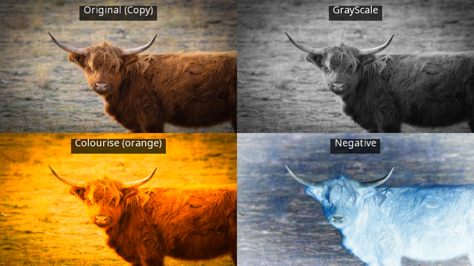
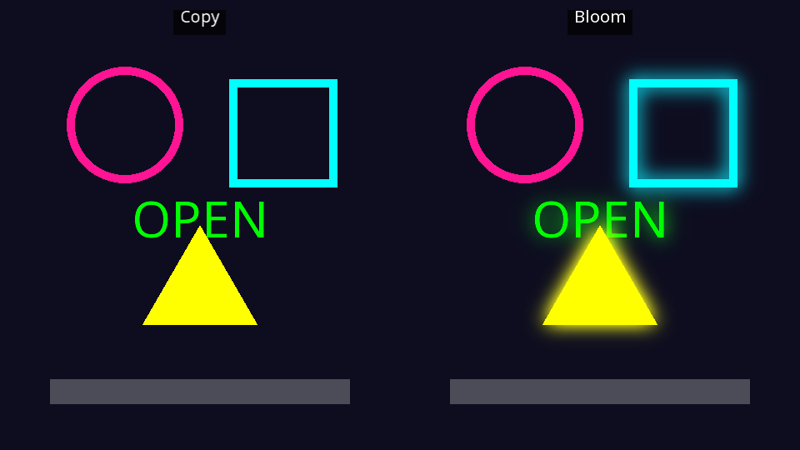
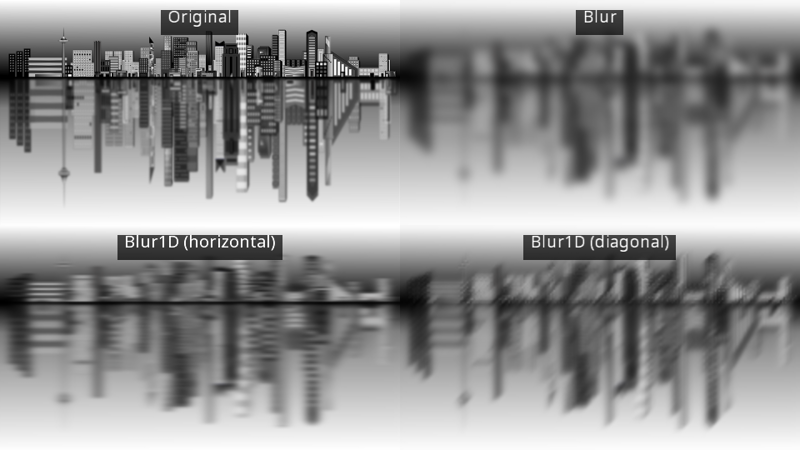
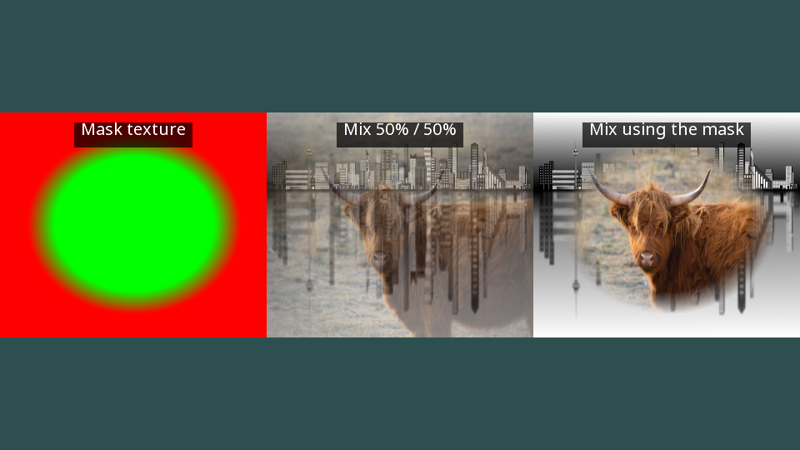

# Post-processing effects

yak2D's effect stages read a surface and write a changed version of it to a render target. The source can be a loaded texture, or (more usually) a render target you have just drawn your scene into. See [The render queue and render stages](renderstages.md) for how stages fit together.

Every effect follows the same three steps:

1. **Create** the stage in `CreateResources()`.
2. **Configure** it (once, or whenever you like, optionally with a smooth transition).
3. **Use** it in the render queue: `q.Effect(stage, source, target)`.

The examples below show "before and after" side by side using [viewports](viewports.md). Their full source is in [Effects.cs](https://github.com/AlzPatz/yak2d-docs-content/blob/master/code/Snippets/Effects.cs).

## Colour effects

A colour effects stage ([IColourEffectsStage](xref:Yak2D.IColourEffectsStage)) can combine several simple colour changes:

[!code-csharp]

[!code-csharp]

[ColourEffectConfiguration](xref:Yak2D.ColourEffectConfiguration) settings are applied in this order:

| Setting | Range | Effect |
|---|---|---|
| `ClearBackground`, `BackgroundClearColour` | | Optionally clear the whole target first. |
| `SingleColour` | 0 to 1 | Blend towards a flat `ColourForSingleColourAndColourise` (1 = solid colour). Good for hit flashes. |
| `GrayScale` | 0 to 1 | Blend towards grey (1 = fully grey). |
| `Colourise` | 0 to 1 | Blend towards a version tinted with `ColourForSingleColourAndColourise` (sepia, night vision...). |
| `Negative` | 0 to 1 | Blend towards the inverted image. |
| `Opacity` | 0 to 1 | Multiply the result's colour and alpha. **Set this to 1**; a new configuration struct has it at 0, which gives a black result. |

With `transitionSeconds`, a stage fades smoothly to new settings, which makes fades to black, flashes and "the world goes grey when you die" effects very little code:

[!code-csharp]

## Bloom

Bloom makes bright areas glow, like a camera looking at a light. The stage keeps only the pixels brighter than a threshold, blurs them, and adds them back on top of the original:

[!code-csharp]

[!code-csharp]

The two numbers passed to [CreateBloomStage()](xref:Yak2D.IStages.CreateBloomStage*) are the size of the smaller surface the glow is worked out on. Smaller is faster and spreads the glow further, but is blockier; a quarter of the source size is a good starting point.

[BloomEffectConfiguration](xref:Yak2D.BloomEffectConfiguration):

| Setting | Effect |
|---|---|
| `BrightnessThreshold` | Pixels with a *luminance* (perceived brightness: 0.2126 R + 0.7152 G + 0.0722 B) below this do not glow. |
| `AdditiveMixAmount` | How strongly the glow is added back. Can be more than 1. |
| `NumberOfBlurSamples` | Blur quality, 1 to 8. |
| `ReSamplerType` | How the image is shrunk: `NearestNeighbour`, `Average2x2` or `Average4x4` (smoothest). |

Luminance weights green heavily and blue hardly at all. In the picture above, the pink circle's luminance is only about 0.3, below the 0.6 threshold, so it does not glow at all, while the green text, cyan square and yellow triangle do. Choose colours with the threshold in mind: in [Yak Run](../tutorials/yakrun-4.md) the stars glow but the (slightly greyer) clouds do not.

## Blur

[Blur](xref:Yak2D.IBlurStage) blurs in every direction; [Blur1D](xref:Yak2D.IBlur1DStage) blurs along one direction only, which gives a sense of speed:

[!code-csharp]

| Setting | Effect |
|---|---|
| `MixAmount` | 0 = the original, 1 = fully blurred. Animate it for focus pulls. |
| `NumberOfBlurSamples` | Blur quality, 1 to 8. |
| `BlurDirection` (Blur1D only) | The direction to blur along, as a unit vector (e.g. `Vector2.UnitX` for horizontal). |
| `ReSamplerType` | As for bloom. |

As with bloom, the sample surface size given when creating the stage controls quality, speed and how far the blur spreads. A blurred copy of the game behind a pause menu is a classic use.

## Style effects

A style effects stage ([IStyleEffectsStage](xref:Yak2D.IStyleEffectsStage)) contains five retro and stylised effects, applied in this order: **pixellate → edge detection → static → old movie → CRT**. A new stage has them all switched off. Each has its own configuration method and a `PreSet(amount)` helper that gives good settings for an amount from 0 to 1:

[!code-csharp]

| Effect | Configuration | Main settings |
|---|---|---|
| Pixellate | [PixellateConfiguration](xref:Yak2D.PixellateConfiguration) | `NumXDivisions`, `NumYDivisions` (how many "big pixels" across and down), `Intensity`. |
| Edge detection | [EdgeDetectionConfiguration](xref:Yak2D.EdgeDetectionConfiguration) | `Intensity`; `IsFreichen` chooses the Frei-Chen filter instead of Sobel. |
| Static | [StaticConfiguration](xref:Yak2D.StaticConfiguration) | `Intensity`, `TimeSpeed` (how fast it changes), `TexelScaler` (size of the noise), `IgnoreTransparent`. |
| Old movie | [OldMovieConfiguration](xref:Yak2D.OldMovieConfiguration) | Scratches, noise, dimming, reel rolls and over-exposure flicker. Start from `PreSet()` or `GenerateDefault()`. |
| CRT | [CrtEffectConfiguration](xref:Yak2D.CrtEffectConfiguration) | Red/green/blue "phosphor" filtering and scanlines. `PreSet(amount, aspectRatio)`. Combine with a [CRT-shaped mesh](mesh.md) for a curved old monitor. |

[SetStyleEffectsGroupConfig()](xref:Yak2D.IStages.SetStyleEffectsGroupConfig*) sets all five at once with a [StyleEffectGroupConfiguration](xref:Yak2D.StyleEffectGroupConfiguration). The static and old movie effects animate by themselves over time.

## Mix

A mix stage ([IMixStage](xref:Yak2D.IMixStage)) blends up to four surfaces. [SetMixStageProperties()](xref:Yak2D.IStages.SetMixStageProperties*) takes a `Vector4` with the amount of each input (X for input 0, Y for input 1, and so on). An optional **mask** texture scales those amounts per pixel: its red channel for input 0, green for input 1, blue for input 2 and alpha for input 3.

[!code-csharp]

[!code-csharp]

Uses include cross-fading between scenes, revealing one image through another, and blending day and night versions of a scene.

## Copy

Not strictly an effect, but [q.Copy(source, target)](xref:Yak2D.IRenderQueue.Copy*) is the simplest step of all: it stretches any surface onto a render target, with no stage needed.

## Performance

Each effect is one or more full-screen passes over its target, so cost grows with the target's size. Blur and bloom do most of their work on the smaller sample surface given when the stage is created, so reducing that size is the quickest way to make them cheaper. Rendering the whole pipeline at a fixed resolution (for example 960 x 540 render targets) and letting the last step stretch it to the window keeps the cost the same on any display.

> [!NOTE]
> **Known issue:** partly transparent shapes drawn onto a render target leave its alpha slightly below 1 there, and the colour effects and distortion stages then show those pixels darker than expected. See [Drawing: Blend states](drawing.md#blend-states).

## See also

- [Distortion](distortion.md), [3D meshes](mesh.md), [Custom shaders](customshaders.md)
- Samples: [Bloom_Example](https://github.com/AlzPatz/yak2d-samples/tree/master/src/Bloom_Example), [Blur_Example](https://github.com/AlzPatz/yak2d-samples/tree/master/src/Blur_Example), [ColourEffects_Example](https://github.com/AlzPatz/yak2d-samples/tree/master/src/ColourEffects_Example), [StyleEffects_CRT](https://github.com/AlzPatz/yak2d-samples/tree/master/src/StyleEffects_CRT), [StyleEffects_OldMovie](https://github.com/AlzPatz/yak2d-samples/tree/master/src/StyleEffects_OldMovie), [Mix_SimpleWholeTextureMixingWithFactors](https://github.com/AlzPatz/yak2d-samples/tree/master/src/Mix_SimpleWholeTextureMixingWithFactors), [Mix_UsingATextureForPerPixelMixing](https://github.com/AlzPatz/yak2d-samples/tree/master/src/Mix_UsingATextureForPerPixelMixing)
