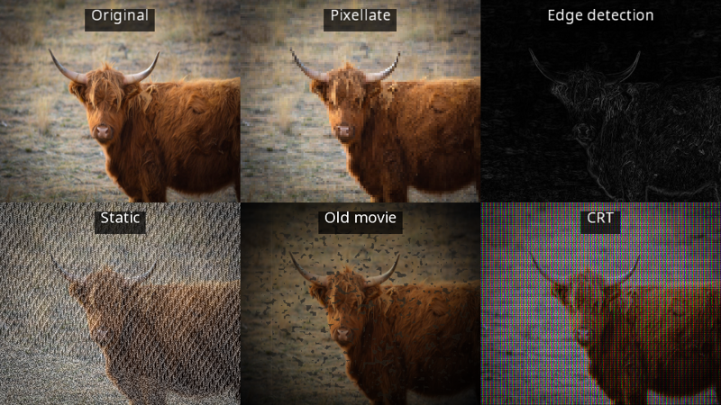

# Features

## Platforms

- **Windows, Linux and macOS**, x64 and arm64, from one codebase.
- **Direct3D 11, Vulkan and OpenGL**, chosen automatically or by you, and switchable while running. (macOS uses OpenGL or Vulkan via MoltenVK; the Metal backend is currently disabled.)
- **.NET 10**, from a single [NuGet package](https://www.nuget.org/packages/Yak2D/). SDL2 and all other native libraries are included; there is nothing else to install.
- Built on [NeoVeldrid](https://www.nuget.org/packages/NeoVeldrid) (a maintained fork of [Veldrid](https://github.com/mellinoe/veldrid)) and SDL2.

## Application framework

- A simple [lifecycle](lifecycle.md): implement nine methods and yak2D runs the window, loop, input and GPU for you.
- [Fixed, adaptive or variable update steps](lifecycle.md#update-timing), with optional "catch up" updates for smooth motion.
- [Resource management](resources.md) with typed references and automatic clean-up, and clear handling of graphics device resets.
- [Window control](window.md): size, fullscreen (exclusive or borderless), resizable, title, vsync, opacity, cursor.

## 2D drawing

- [Draw stages](drawing.md) that sort by layer, depth and texture, and batch automatically.
- Coloured, textured and dual-textured triangles, from [helpers](drawing.md#the-helper-functions), a [fluent shape builder](drawing.md#the-fluent-shape-builder) or [your own vertices](drawing.md#draw-requests).
- Quads, regular polygons, circles, lines, arrows, outlines and custom polygons.
- Per-vertex colours, texture tinting, wrapping and mirroring, sprite sheets, flipping.
- [Layers and depth](drawing.md#layers-and-depth) with correct transparency.
- [Blend states](drawing.md#blend-states): alpha, additive and override.
- [Bitmap font text](text.md): a built-in font, BMFont loading, justification, kerning and measuring.

## Cameras and coordinates

- [2D cameras](cameras.md) with a virtual resolution (resolution independence), focus, zoom and rotation.
- [World and screen space](coordinatesystems.md) drawing, side by side.
- [Viewports](viewports.md) for split screen and picture-in-picture.
- [Coordinate conversion](coordinatesystems.md#converting-between-spaces) between window, screen and world positions (mouse picking).
- 3D cameras for mesh rendering.

## Rendering pipeline and effects

- A [render queue](renderstages.md) that chains stages through [render targets](surfaces.md) in any order.
- [Colour effects](effects.md#colour-effects): single colour, grayscale, colourise, negative, opacity.
- [Bloom](effects.md#bloom), [blur and directional blur](effects.md#blur).
- [Style effects](effects.md#style-effects): pixellate, edge detection, static, old movie, CRT.
- [Mixing](effects.md#mix) up to four surfaces, with per-pixel masks.
- [Distortion](distortion.md): height-map based ripples and shock waves, with helpers.
- [3D mesh rendering](mesh.md): quads, spheres, cubes and CRT-shaped meshes, with up to 8 lights.
- Smooth [transitions](renderstages.md#smooth-transitions) between effect settings.
- [Custom shaders](customshaders.md) in GLSL, compiled at runtime for any graphics API.
- [Custom Veldrid stages](customveldrid.md) for full low-level access (compute shaders and more).
- [GPU to CPU readback](readback.md) of any surface.

## Input

- [Keyboard, mouse and gamepads](input.md), with held, pressed-this-update and released-this-update states and hold durations.

## Not included

yak2D deliberately does not include audio, physics, networking, an entity system or a visual editor. Use any .NET library you like alongside it.
