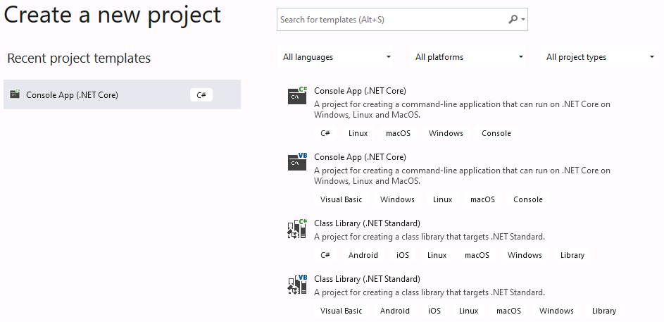
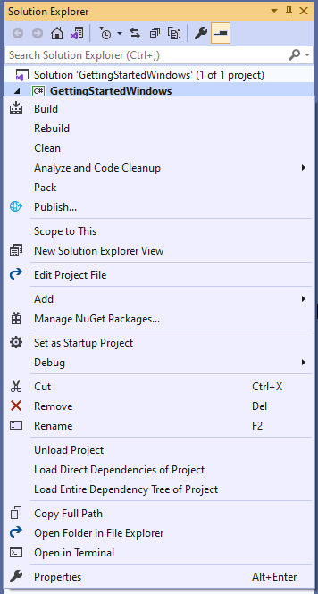
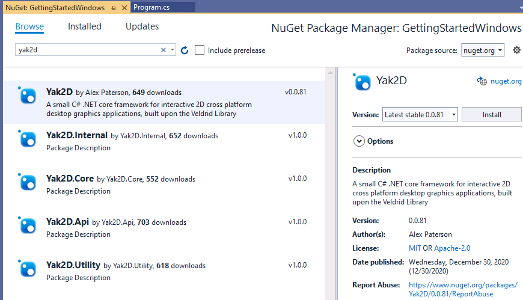
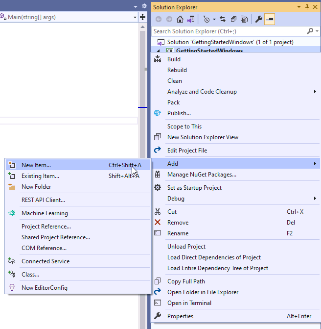
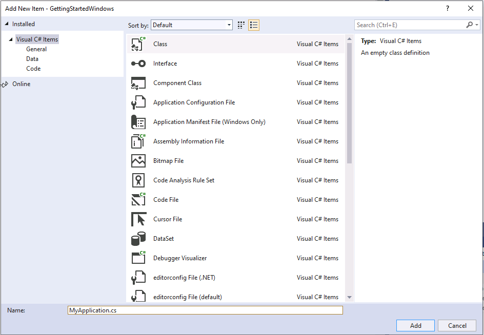
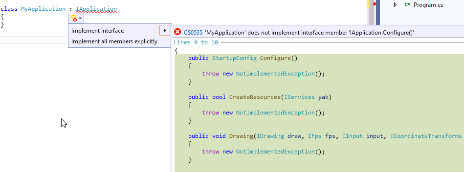

# Getting Started

## Aim
By the end of this article you will have created a new project that uses **yak2D**. You will have created the outline of an application, which clears the display to a colour and exits when the escape key is pressed.

This blank project will be used as the starting point for further tutorials (or your own applications!)

## Prerequisites 
* A desktop OS (Windows, Linux or MacOS)
* Basic C# knowledge

## Environment Setup

You wil require software to help you write code
- **Windows**: [Visual Studio](https://visualstudio.microsoft.com/)
- **Linux** and **MacOS**: A [text editor](https://code.visualstudio.com/) of any sort 

**yak2D** applications are built with .NET. **yak2D** targets the `NetStandard2.0` framework. 

This tutorial uses the command line tooling `dotnet [command]` for Linux and MacOS environments. Whilst the command line tools are also available for Windows, using the [Visual Studio IDE](https://visualstudio.microsoft.com/) is described below. 

### Windows

1. Download the Visual Studio IDE. At the time of writing the free version of Visual Studio is Community 2019
    - During the installation, install .NET Core desktop development packages (at the time of writing, this is included under the ".NET desktop development" workload option presented by the Visual Studio Installer)
2. Open Visual Studio and Create a new Console App (.NET Core). Choose the project name and disk location

3. Once the project is open, add the **yak2D** nuget packages to your project:
    - In the solution explorer, right click on the project and go to "Manage Nuget Packages"
    
    - In the Nuget Package Manager, navigate to the browse tab
    - Search for "yak2D" and install the latest stable version
    
4. Once the **yak2D** package has downloaded, and you have accepted any licenses, add a new class file to your project. This file will hold your the root of your application's code:
    - In the solution explorer, right click on the project and go to "Add", then "New Item..."
    
    - Choose "Class" and name your file with a `.cs` extension. For this tutorial `MyApplication.cs` was chosen
    

With the project set up, ready for code, please scroll down and continue with the [writing code](xref:uid_tut_gettingstarted#Writing-Code) section.

### Linux
1. Download your chosen text editor
2. Install .NET

### MacOS
*Under Construction a.k.a waiting for some time with a Mac. Installing .NET on MacOS is relatively easy, please google for a guide. Dotnet command line functions then work the same as on a linux distro*

## Writing Code
*At this stage it is assumed you have a .NET core console project created with two source files: `Program.cs` and `MyApplication.cs`*. 

To launch a **yak2D** application you must create a class that implements the [IApplication](xref:Yak2D.IApplication) interface, instantiate an instance of the class, and pass that to the [Launcher.Run()](xref:Yak2D.Launcher.Run) method:

1. In `MyApplication.cs` add the following using statement at the top of the file:

    `using Yak2D;`

2. In `MyApplication.cs` let the class inherrit from the [IApplication](xref:Yak2D.IApplication) interface by changing the class definition line from:

    `class MyApplication`

    to

    `class MyApplication : IApplication`

3. We now need to provide implementations of the methods described by the [IApplication](xref:Yak2D.IApplication) interface.

    * We will tackle each method one at a time. If you are using a variant of Visual Studio or another IDE with the ability, you can ask the editor to automatically fill in blank methods for the interface to save some typing. In Visual Studio (windows) you can navigate to the drop down button under the red squiggly line and click on `Implement Interface`:
    
    * *Please note*: The auto-fill functions are not guaranteed to order the methods in the most logical way. Whilst the order in which the methods appear in the source code file **do not matter**, it is recommended to re-order your methods in the way described below to better reflect program execution flow and code understanding.
    * All methods should be written between the opening curly bracket ({) following `class MyApplication : IApplication` and the next closing curly bracket immediately following.
    * **Implement [OnStartup()](xref:Yak2D.IApplication.OnStartup)**. This method runs before any other in the application and allows you to add any code you wish to run ahead of the application's other methods. In this instance, we do not have any code we wish to run, so we provide an empty method implementation:
    ```
    public void OnStartup() { }
    ```
    * **Implement [Configure()](xref:Yak2D.IApplication.Configure)**. This method returns an instance of the [StartupConfig](xref:Yak2D.StartupConfig) class, which holds application configuration information. It is called once at application start up. We can use a helper method within [StartupConfig](xref:Yak2D.StartupConfig) to simplify the creation and get some default values. Below we pass a window resolution of 960 by 540 pixels, a string for the window title of "My Application!" and finally we pass `false` for whether to open the application in fullscreen mode (i.e requesting a windowed application).
    ```
    public StartupConfig Configure()
    {
        return StartupConfig.Default(960, 540, "My Application!", false);
    }
    ```
    * **Implement [CreateResources()](xref:Yak2D.IApplication.CreateResources)**. All [resource](xref:uid_glossary#Resource) creation should be completed within, or be triggered by, this method. It runs once before the main update and rendering loops begin and is also triggered if the application loses it's [resources](xref:uid_glossary#Resource) at anytime. A blank application uses no resources so for now an empty method is all that is required. The method must return `true` to indicate to the framework that it was successful:
    ```
    public bool CreateResources() 
    { 
        return true;
    }
    ```
    * **Implement [ProcessMessage()](xref:Yak2D.IApplication.ProcessMessage)**. Ahead of an [UpdateStep](xref:uid_glossary#updatestep), this method is called once for every message generated by the framework. Allows the application to be informed about a number of different events, such as a gamepad being added or the window being resized. There are no messages we need to process for the blank application, so you guessed it, we create another empty method implementation:
    ```
    public void ProcessMessage(FrameworkMessage msg, IServices yak) { }
    ```
    * **Implement [Update()](xref:Yak2D.IApplication.Update)**. Called during an [UpdateStep](xref:uid_glossary#updatestep). Used for non-drawing and rendering application logic. For this application we simply return `false` (which triggers an application shutdown) if the `escape` key is pressed.
    ```
    public void Update(IServices yak, float secondsSinceLastUpdate)
    {
        return !yak.Input.IsKeyCurrentlyPressed(KeyCode.Escape);
    }
    ```
    * **Implement [PreDrawing()](xref:Yak2D.IApplication.PreDrawing)**. The first user method of three called during a [RenderStep](xref:uid_glossary#renderstep). A place for non-drawing or rendering code to be executed ahead of drawing and rendering. Again, for a blank application, we create an empty method.
    ```
    public void PreDrawing(IServices yak, float secondsSinceLastDraw, float secondsSinceLastUpdate) { }
    ```
    * **Implement [Drawing()](xref:Yak2D.IApplication.Drawing)**. The second user method of three called during a [RenderStep](xref:uid_glossary#renderstep). As the name implies, this method is used for [drawing](xref:uid_glossary#drawing), namely creating and submitting [DrawRequests](xref:Yak2D.DrawRequest) to [DrawStages](xref:Yak2D.IDrawStage). The blank application does not contain a [DrawStage](xref:Yak2D.IDrawStage) and so an empty method is created.
    ```
    public void Drawing(IDraw draw, IFps fps, IInput input, ICoordinateTransforms transforms, float secondsSinceLastDraw, float secondsSinceLastUpdate) { }
    ```
    * **Implement [Rendering()](xref:Yak2D.IApplication.Rendering)**. The third user method of three called during a [RenderStep](xref:uid_glossary#renderstep). In this method the user must build the [RenderQueue](xref:uid_glossary#renderqueue) by calling methods provided by the [IRenderQueue](xref:Yak2D.IRenderQueue) instance. In this example, the only action to queue is to clear the window's [RenderTarget](xref:Yak2D.IRenderTarget) colour data with a colour as well as clearing its depth buffer. *Note: A user may choose for the framework to automatically clear the window's [RenderTarget](xref:Yak2D.IRenderTarget)'s colour and depth ahead of actions placed into the [RenderQueue](xref:uid_glossary#renderqueue). In fact, the default[StartupConfig](xref:Yak2D.StartupConfig) provided by the helper method used in [Configure()](xref:Yak2D.IApplication.Configure) above is set to auto-clear. The auto-clear colour is always transparent black RGBA(0, 0, 0, 0). Therefore in the code below, the depth clear is not technically required*
    ```
    public void Rendering(IRenderQueue q, IRenderTarget windowRenderTarget)
    {
        q.ClearDepth(windowRenderTarget);
        q.ClearColour(windowRenderTarget, Colour.Pink);
    }
    ```
    * **Implement [Shutdown()](xref:Yak2D.IApplication.Shutdown)**. Called upon application exit. A place for the user application to release any acquired resources not related to the **yak2D** framework and that will not be disposed of automatically. In this blank application, an empty method suffices.
    ```
    public void Shutdown() { }
    ```
    

