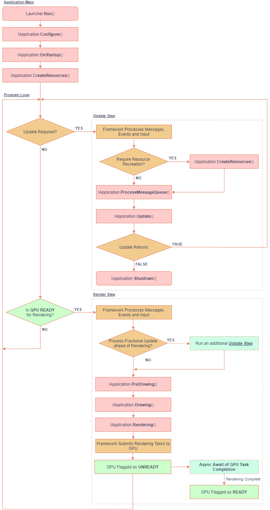

# **yak2D** Application Lifecycle

Below is a diagram of program flow for an application using the **yak2D** framework.

Methods which the user defines or calls are coloured in light pink.

The program loop is broadly split into two parts ('steps'): **Update** and **Render**

The frequency of Update steps is defined by the [UpdatePeriod](xref:Yak2D.UpdatePeriod) Type declared in the [StartupConfig](xref:Yak2D.StartupConfig) returned by the [Configure](xref:Yak2D.IApplication.Configure) method of the user's [IApplication](xref:Yak2D.IApplication) implementation.

The render steps are executed whenever all required Updates have been processed and as quickly as the GPU is able too (subject to vertical sync waits if required). Once Render commands are passed to the GPU, the main execution thread is not blocked, allowing additional Update steps to be processed, if required, until the GPU becomes free again.