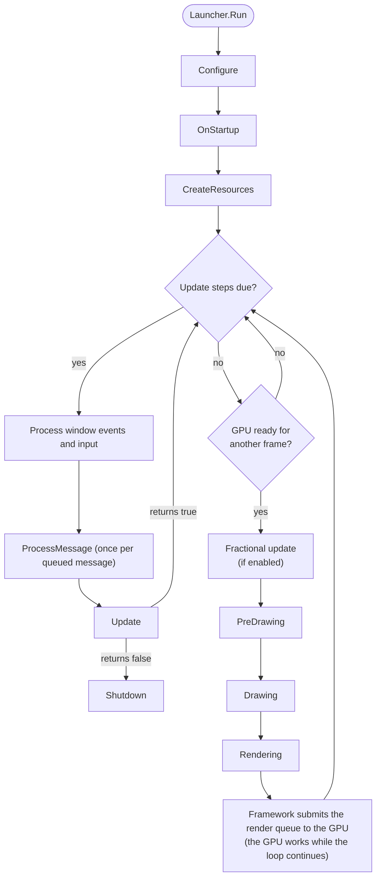

# Application lifecycle

This page describes exactly when yak2D calls each of your [IApplication](xref:Yak2D.IApplication) methods, and how update and frame timing works.

## Start up

When you call [Launcher.Run()](xref:Yak2D.Launcher.Run*), yak2D:

1. Calls **[Configure()](xref:Yak2D.IApplication.Configure)** and reads the [StartupConfig](xref:Yak2D.StartupConfig) you return.
2. Creates the window and graphics device using that configuration.
3. Calls **[OnStartup()](xref:Yak2D.IApplication.OnStartup)**.
4. Calls **[CreateResources()](xref:Yak2D.IApplication.CreateResources*)**. If it returns `false`, the application shuts down straight away.
5. Enters the main loop.

> [!NOTE]
> `Configure()` runs *before* `OnStartup()`. So `Configure()` cannot depend on anything you set up in `OnStartup()`: if your configuration comes from a settings file, read it in `Configure()` (or in your constructor).

`OnStartup()` is for setting up your own objects (game state, lists, random number generators). Anything created by yak2D, such as textures, stages or cameras, belongs in `CreateResources()`, which may be called again later (see [Device resets](#device-resets)).

## The main loop

The loop has two independent parts: **update steps** and **frames** (also called draw or render steps). Each time round the loop, yak2D runs as many update steps as are due, then draws a frame if the GPU has finished the previous one.


```mermaid
flowchart TD
    Start([Launcher.Run]) --> C[Configure]
    C --> O[OnStartup]
    O --> R[CreateResources]
    R --> L{Update steps due?}
    L -- yes --> U1[Process window events and input]
    U1 --> PM["ProcessMessage (once per queued message)"]
    PM --> U[Update]
    U -- returns false --> SD[Shutdown]
    U -- returns true --> L
    L -- no --> G{GPU ready for<br/>another frame?}
    G -- no --> L
    G -- yes --> F["Fractional update<br/>(if enabled)"]
    F --> PD[PreDrawing]
    PD --> D[Drawing]
    D --> RE[Rendering]
    RE --> GPU["Framework submits the render queue to the GPU<br/>(the GPU works while the loop continues)"]
    GPU --> L
```

### An update step

Each update step:

1. Processes window events (SDL) and gathers input.
2. Calls **[ProcessMessage()](xref:Yak2D.IApplication.ProcessMessage*)** once for each [FrameworkMessage](xref:Yak2D.FrameworkMessage) waiting in the queue.
3. Calls **[Update()](xref:Yak2D.IApplication.Update*)** with the length of the step in seconds. Returning `false` ends the application.

Input state is tied to update steps. "Pressed this frame" and "released this frame" queries ([WasKeyPressedThisFrame](xref:Yak2D.IInput.WasKeyPressedThisFrame*) and friends) are true for exactly **one update step**. Check them in `Update()`, not in the drawing methods, or you may miss presses or see them twice. See [Input](input.md).

### A frame

When the GPU has finished the previous frame, yak2D:

1. Optionally runs one extra, shorter update step (see [Fractional updates](#fractional-updates)).
2. Calls **[PreDrawing()](xref:Yak2D.IApplication.PreDrawing*)**: move cameras, update effect settings, advance animations.
3. Prepares the draw stages (auto-clearing ones are emptied), then calls **[Drawing()](xref:Yak2D.IApplication.Drawing*)**: submit draw requests.
4. Calls **[Rendering()](xref:Yak2D.IApplication.Rendering*)**: build the render queue.
5. Submits the queued GPU work, and carries straight on with the loop. The GPU renders in the background; the next frame starts once it has finished.

Both drawing methods receive `secondsSinceLastDraw` (use it for purely visual animation) and `secondsSinceLastUpdate` (how far "between" update steps this frame is, useful for interpolating positions).

## Update timing

[StartupConfig.UpdatePeriodType](xref:Yak2D.StartupConfig.UpdatePeriodType) chooses how update steps are timed:

| [UpdatePeriod](xref:Yak2D.UpdatePeriod) | Behaviour |
|---|---|
| `Fixed` (default) | Every update step is exactly [FixedOrSmallestUpdateTimeStepInSeconds](xref:Yak2D.StartupConfig.FixedOrSmallestUpdateTimeStepInSeconds) long (1/120 s by default). If time has passed for several steps, several run back to back. |
| `Fixed_Adaptive` | Starts fixed, but doubles the step if updates are using nearly all the available time, and halves it again when there is time to spare. The step is never smaller than 1/120 s. |
| `Variable` | Each update step is as long as the real time since the last one, but never shorter than `FixedOrSmallestUpdateTimeStepInSeconds`. |

A fixed step is the easiest to reason about: physics and movement behave identically however fast the computer is. The [Yak Run](../tutorials/yakrun-2.md) tutorial relies on this.

### Fractional updates

With a fixed step there is usually some time left over when a frame is due: for example 3 ms of a 8.3 ms step. If [ProcessFractionalUpdatesBeforeDraw](xref:Yak2D.StartupConfig.ProcessFractionalUpdatesBeforeDraw) is `true` (the default), yak2D runs one extra update step of just that leftover time before drawing, so the frame shows the world exactly "now". This makes motion smooth, but means `Update()` is occasionally called with a shorter time step than normal. Always use the `secondsSinceLastUpdate` you are given rather than assuming the configured step.

If you would rather every step be identical (for example, for a deterministic simulation or replays), set it to `false` and, if you want extra smoothness, interpolate in the drawing methods using `secondsSinceLastUpdate`.

### Frames without updates

[RequireAtleastOneUpdatePerDraw](xref:Yak2D.StartupConfig.RequireAtleastOneUpdatePerDraw) (default `true`) stops a frame being drawn unless at least one update step has run since the previous frame. Nothing would have changed, so there is nothing new to draw. Before the very first frame, at least one update step always runs.

### Frame rate and vsync

With [SyncToVerticalBlank](xref:Yak2D.StartupConfig.SyncToVerticalBlank) on (the default), frames are limited to the display's refresh rate, avoiding tearing. With it off, frames are drawn as fast as the GPU allows. You can change it at runtime with [IDisplay.SetVsync()](xref:Yak2D.IDisplay.SetVsync*). The current update and draw rates are available from [IFps](xref:Yak2D.IFps):

[!code-csharp[](../code/Snippets/Application.cs#fps)]

## Framework messages

[ProcessMessage()](xref:Yak2D.IApplication.ProcessMessage*) receives these [FrameworkMessage](xref:Yak2D.FrameworkMessage) values:

| Message | Meaning | What to do |
|---|---|---|
| `GraphicsDeviceRecreated` | The graphics device was recreated. **All yak2D resources are gone.** | Recreate them: call `CreateResources()` (see below). |
| `SwapChainFramebufferReCreated` | The window's render target was recreated, e.g. after a resize. | Nothing, unless you stored the window render target yourself. Rebuild any [viewports](viewports.md) that depend on the window size. |
| `WindowWasResized` | The window changed size. | Optional: react to the new size ([IDisplay](xref:Yak2D.IDisplay)). |
| `WindowGainedFocus` / `WindowLostFocus` | The window gained or lost keyboard focus. | Optional: pause the game when focus is lost. |
| `GamepadAdded` / `GamepadRemoved` | A gamepad was connected or disconnected. | Optional: refresh [IInput.ConnectedGamepadIds()](xref:Yak2D.IInput.ConnectedGamepadIds). |
| `ApplicationWindowClosing` | The window is closing. | See the warning below. |
| `LowMemoryReported` | The operating system reported low memory. | Optional. |

> [!WARNING]
> `ApplicationWindowClosing` is also sent (twice) while the graphics API is being switched with [IBackend.SetGraphicsApi()](xref:Yak2D.IBackend.SetGraphicsApi*), because the window is recreated during the switch. If your application quits when it receives this message, it will also quit when switching API. When the user closes the window, yak2D ends the loop itself, so you rarely need to act on this message.

## Device resets

The graphics device is recreated when you switch graphics API ([IBackend.SetGraphicsApi()](xref:Yak2D.IBackend.SetGraphicsApi*)), and can also be recreated by the platform. When that happens every texture, render target, stage, camera, viewport and font is destroyed, and you receive `GraphicsDeviceRecreated`.

**yak2D does not call `CreateResources()` for you again.** Handle the message yourself:

[!code-csharp[](../code/Snippets/Application.cs#recreation)]

This is why it pays to create *every* yak2D resource in `CreateResources()`, and to keep your game state in ordinary C# objects that are not affected. After a reset you may see a few "Unable to retrieve surface" console messages for the one frame that is rendered before your application has processed the message; they are harmless.

## Shutdown

The application shuts down when `Update()` returns `false`, when `CreateResources()` returns `false` at start up, or when the user closes the window. yak2D then calls **[Shutdown()](xref:Yak2D.IApplication.Shutdown)**, releases all of its own resources, and `Launcher.Run()` returns. Use `Shutdown()` for anything of your own that needs releasing or saving (settings, open files, audio). yak2D resources are released automatically.

## Framework console messages

yak2D reports what it is doing (graphics API chosen, warnings, errors) through an [IFrameworkMessenger](xref:Yak2D.IFrameworkMessenger). By default these are written to the console. To send them somewhere else, such as a log file or your own in-game console, pass your own implementation to `Launcher.Run()`:

```csharp
public class FileLogger : IFrameworkMessenger
{
    private readonly StreamWriter _log = new StreamWriter("yak2d.log");
    public void Report(string message) => _log.WriteLine(message);
    public void Shutdown() => _log.Dispose();
}

Launcher.Run(new MyGame(), new FileLogger());
```
