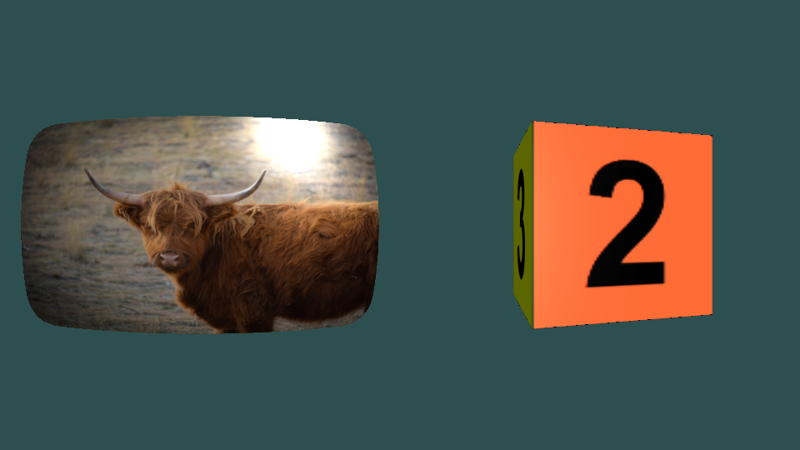

# 3D meshes

yak2D is a 2D framework, but the **mesh render stage** ([IMeshRenderStage](xref:Yak2D.IMeshRenderStage)) can wrap any surface round a lit 3D shape. Typical uses are a curved "old television" screen, a spinning planet or dice, or a 2D scene tilted in 3D for a transition.

## Setting up

A mesh render stage needs a **mesh** (the shape), some **lights**, and a [3D camera](cameras.md#3d-cameras):

[!code-csharp]

## Rendering

[q.MeshRender(stage, camera3D, source, target)](xref:Yak2D.IRenderQueue.MeshRender*) draws the mesh, textured with the source surface. The source can be a render target, so a whole 2D scene can be put on the 3D shape (the [Mesh_HelperExamples](https://github.com/AlzPatz/yak2d-samples/tree/master/src/Mesh_HelperExamples) sample does this).

[!code-csharp]

Mesh rendering uses the target's depth buffer, so clear the depth first.

## Meshes

A mesh is an array of [Vertex3D](xref:Yak2D.Vertex3D) (position, normal and texture coordinates), three per triangle. You can build your own, or use the builders in `yak.Helpers.CommonMeshBuilder` ([ICommonMeshBuilder](xref:Yak2D.ICommonMeshBuilder)):

| Builder | Shape |
|---|---|
| [CreateQuadMesh](xref:Yak2D.ICommonMeshBuilder.CreateQuadMesh*) | A flat rectangle. |
| [CreateCrtMesh](xref:Yak2D.ICommonMeshBuilder.CreateCrtMesh*) | A gently curved rectangle with rounded corners, like an old monitor. |
| [CreateRectangularCuboidMesh](xref:Yak2D.ICommonMeshBuilder.CreateRectangularCuboidMesh*) | A box. The texture is split into a 3 x 2 grid, one cell per face (see [RectangularCuboidMeshTexCoords](xref:Yak2D.RectangularCuboidMeshTexCoords)). |
| [CreateSphericalMesh](xref:Yak2D.ICommonMeshBuilder.CreateSphericalMesh*) | A sphere, or an ellipsoid if the sizes differ. The texture is wrapped round it like a world map. |

Set a stage's mesh with [SetMeshRenderMesh()](xref:Yak2D.IStages.SetMeshRenderMesh*). Changing it every frame is fine (the example rebuilds a rotating cube each frame).

## Lighting

Lighting is per-pixel (Phong). A stage has up to **8 lights**, set with [SetMeshRenderLights()](xref:Yak2D.IStages.SetMeshRenderLights*), and some overall properties set with [SetMeshRenderLightingProperties()](xref:Yak2D.IStages.SetMeshRenderLightingProperties*):

| [MeshRenderLightingPropertiesConfiguration](xref:Yak2D.MeshRenderLightingPropertiesConfiguration) | |
|---|---|
| `NumberOfActiveLights` | How many of the lights to use (up to 8). |
| `SpecularColour` | The colour of shiny highlights. |
| `Shininess` | 1 or less is matt; higher values give smaller, sharper highlights. |

| [MeshRenderLightConfiguration](xref:Yak2D.MeshRenderLightConfiguration) | |
|---|---|
| `LightType` | `Directional` (like sunlight: same direction everywhere) or `Spotlight` (a cone from a point). |
| `Position` | For directional lights, the **direction** the light travels. For spotlights, the light's position. |
| `Colour` | The light's colour (as a `Vector3`: `Colour.White.ToVector3()`). |
| `AmbientCoefficient` | How much light reaches surfaces facing away from the light. |
| `ConeDirection`, `ConeAngle`, `Attenuation` | Spotlights only: where it points, how wide the cone is, and how quickly it fades with distance. |

Both methods take an optional `transitionSeconds` to animate the lighting smoothly. A new stage has a default light facing the camera.

## See also

- Samples: [Mesh_HelperExamples](https://github.com/AlzPatz/yak2d-samples/tree/master/src/Mesh_HelperExamples) (all four builders, with a fly-through camera), [Mesh_ManualMeshSimple](https://github.com/AlzPatz/yak2d-samples/tree/master/src/Mesh_ManualMeshSimple), [Mesh_ManualChangingMesh](https://github.com/AlzPatz/yak2d-samples/tree/master/src/Mesh_ManualChangingMesh), [StyleEffects_CRT](https://github.com/AlzPatz/yak2d-samples/tree/master/src/StyleEffects_CRT)
- [Coordinate systems: 3D](coordinatesystems.md#3d-rendering)
