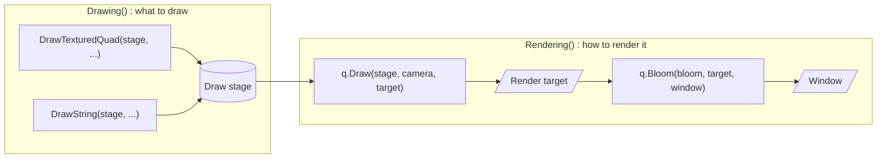

# How yak2D works

This page explains the handful of ideas that the whole framework is built on. Once these click, the rest of yak2D is mostly details.

## yak2D is a framework: it calls you

A *library* is code you call. A *framework* calls your code. yak2D is a framework because it needs to control the timing of your game: when to process input, when to update the simulation, and when the GPU is ready for the next frame.

You write a class that implements [IApplication](xref:Yak2D.IApplication) and pass an instance to [Launcher.Run()](xref:Yak2D.Launcher.Run*):

```csharp
using Yak2D;

Launcher.Run(new MyGame());   // returns when the application shuts down
```

The framework then calls your class's methods at the right moments. There are nine of them, in three groups:

| When | Method | What you do there |
|---|---|---|
| **Once, at start up** | [Configure()](xref:Yak2D.IApplication.Configure) | Return a [StartupConfig](xref:Yak2D.StartupConfig): window size, title, timing, graphics API... |
| | [OnStartup()](xref:Yak2D.IApplication.OnStartup) | Set up your own (non-yak2D) objects. |
| | [CreateResources()](xref:Yak2D.IApplication.CreateResources*) | Create yak2D resources: textures, draw stages, cameras, render targets... |
| **Every update step** | [ProcessMessage()](xref:Yak2D.IApplication.ProcessMessage*) | React to [framework messages](xref:Yak2D.FrameworkMessage) (window resized, gamepad connected, device reset...). |
| | [Update()](xref:Yak2D.IApplication.Update*) | Game logic: input, movement, collisions. Return `false` to quit. |
| **Every frame** | [PreDrawing()](xref:Yak2D.IApplication.PreDrawing*) | Last-minute changes before drawing: move cameras, change effect settings. |
| | [Drawing()](xref:Yak2D.IApplication.Drawing*) | Describe what to draw: submit shapes, sprites and text to *draw stages*. |
| | [Rendering()](xref:Yak2D.IApplication.Rendering*) | Describe *how* to render the frame: which stages run, in which order, onto which surfaces. |
| **Once, at exit** | [Shutdown()](xref:Yak2D.IApplication.Shutdown) | Release anything of your own. |

Updates and frames run on separate clocks: by default updates happen at a fixed 120 per second, while frames are drawn as fast as the display allows. See [Application lifecycle](lifecycle.md) for the exact timing rules.

## Services: everything you can ask yak2D to do

Most methods receive an [IServices](xref:Yak2D.IServices) parameter, conventionally named `yak`. It is your way into the framework:

| Service | Used for |
|---|---|
| `yak.Surfaces` ([ISurfaces](xref:Yak2D.ISurfaces)) | Loading textures, creating render targets |
| `yak.Stages` ([IStages](xref:Yak2D.IStages)) | Creating and configuring render stages and viewports |
| `yak.Cameras` ([ICameras](xref:Yak2D.ICameras)) | Creating and moving 2D and 3D cameras |
| `yak.Fonts` ([IFonts](xref:Yak2D.IFonts)) | Loading bitmap fonts, measuring text |
| `yak.Input` ([IInput](xref:Yak2D.IInput)) | Keyboard, mouse and gamepads |
| `yak.Display` ([IDisplay](xref:Yak2D.IDisplay)) | The window: size, fullscreen, title, vsync, cursor |
| `yak.Backend` ([IBackend](xref:Yak2D.IBackend)) | Which graphics API is in use, and switching it |
| `yak.FPS` ([IFps](xref:Yak2D.IFps)) | Update and draw rates |
| `yak.Helpers` ([IHelpers](xref:Yak2D.IHelpers)) | Coordinate conversion, mesh builders, distortion helpers |

[Drawing()](xref:Yak2D.IApplication.Drawing*) is slightly different: instead of `IServices` it receives exactly what drawing needs, including [IDrawing](xref:Yak2D.IDrawing) (`draw`), which submits things to be drawn.

## Resources: you hold references, yak2D holds the objects

Textures, render targets, render stages, cameras, viewports and fonts are **resources**. yak2D creates and owns them; you get back a small reference object (an [ITexture](xref:Yak2D.ITexture), an [IDrawStage](xref:Yak2D.IDrawStage), ...) that you pass back to the framework when you want to use it.

Resources are created in [CreateResources()](xref:Yak2D.IApplication.CreateResources*). If the graphics device is ever recreated (for example when the graphics API is switched), **every resource is lost** and you receive the [GraphicsDeviceRecreated](xref:Yak2D.FrameworkMessage) message. The simple, robust pattern is to call `CreateResources()` again when that happens. See [Resources and references](resources.md).

## Drawing and rendering are two different steps

This is the most important idea in yak2D.

**Drawing** means *describing* what should appear: "a yak texture here, a green rectangle there, this text at the top". You submit these descriptions, called **draw requests**, to a **draw stage** ([IDrawStage](xref:Yak2D.IDrawStage)). Nothing appears on screen yet. The draw stage sorts its requests (by layer, depth and texture) and batches them efficiently for the GPU.

**Rendering** means *running the GPU work* that produces the frame. In [Rendering()](xref:Yak2D.IApplication.Rendering*) you build a **render queue**: an ordered list of operations such as "clear the window", "render this draw stage through this camera onto this surface", "blur this surface onto that one". The framework then executes the queue.



This separation is what makes yak2D flexible. The same draw stage can be rendered twice through two cameras (split screen). A scene can be rendered into an off-screen surface, blurred, mixed with another, wrapped round a 3D mesh, and only then shown in the window.

## Render stages and surfaces

A **render stage** ([IRenderStage](xref:Yak2D.IRenderStage)) is one reusable step of GPU work. Draw stages are one kind; the others are effects and utilities:

| Stage | Reads | Does |
|---|---|---|
| [Draw](drawing.md) | its queued draw requests | Draws 2D shapes, sprites and text through a 2D camera |
| [Colour effects](effects.md#colour-effects) | a texture | Grayscale, tint, negative, fade... |
| [Bloom](effects.md#bloom) | a texture | Makes bright areas glow |
| [Blur / Blur1D](effects.md#blur) | a texture | Blurs in both, or one, direction |
| [Style effects](effects.md#style-effects) | a texture | Pixellate, edge detection, static, old movie, CRT |
| [Mix](effects.md#mix) | up to four textures | Blends textures together |
| [Distortion](distortion.md) | a texture + its queued height map drawing | Ripples, shock waves, heat haze |
| [Mesh render](mesh.md) | a texture | Wraps a texture round a lit 3D mesh |
| [Custom shader](customshaders.md) | up to four textures | Runs your own fragment shader |
| [Custom Veldrid](customveldrid.md) | up to four textures | Runs your own low-level NeoVeldrid code |
| [Surface copy](readback.md) | a texture | Copies pixels back to the CPU |

Stages read from and write to **surfaces**: a [texture](xref:Yak2D.ITexture) is an image you can read from; a [render target](xref:Yak2D.IRenderTarget) is a surface you can also render onto (and read from later). The window itself is a render target, passed to `Rendering()` as `windowRenderTarget`. See [Surfaces and render targets](surfaces.md).

## Cameras and coordinates

Draw stages are rendered through a **2D camera** ([ICamera2D](xref:Yak2D.ICamera2D)). A camera has a *virtual resolution*, for example 960 x 540, which is how many units it shows across and down, whatever the real window size. Each draw request is in either:

- **World space**: moved, zoomed and rotated by the camera. Use it for the game world.
- **Screen space**: fixed to the camera's view, with (0,0) in the middle. Use it for HUDs and menus.

See [Cameras](cameras.md) and [Coordinate systems](coordinatesystems.md).

## Putting it together

Here is a complete, minimal program that draws a sprite and then applies an effect to the whole scene. Everything in it is explained in the guides and in the [Yak Run tutorial](../tutorials/yakrun-1.md).

[!code-csharp[](../code/Snippets/Overview.cs#overview)]

Run it with `Launcher.Run(new OverviewGame());`.

> [!NOTE]
> This example loads `Textures/yak.png` as an *embedded resource*. See [Assets](assets.md) for how to add image files to a project.

## Next

- [Application lifecycle](lifecycle.md): exact call order and timing
- [Drawing](drawing.md): everything about draw stages and draw requests
- [The render queue and render stages](renderstages.md): building rendering pipelines
