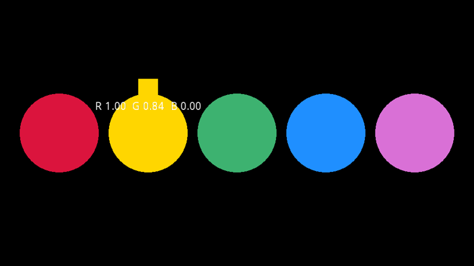

# Reading pixels back (GPU to CPU)

Rendering happens on the GPU, and its results normally stay there. A **surface copy stage** ([ISurfaceCopyStage](xref:Yak2D.ISurfaceCopyStage)) copies a surface's pixels back into an array your code can read. Uses include:

- pixel-perfect mouse picking (draw each object in a unique colour, read the colour under the mouse),
- saving screenshots,
- reading the results of GPU calculations (for example a [custom shader](customshaders.md) or compute stage),
- testing.

## Setting up

[!code-csharp]

[CreateSurfaceCopyDataStage()](xref:Yak2D.IStages.CreateSurfaceCopyDataStage*) takes:

- the size of the internal "staging" texture. Match the surface you will copy; a different size works but is recreated each time, which is slower.
- a **callback**, called with a [TextureData](xref:Yak2D.TextureData) once the pixels arrive. It is called on the main thread, so it can safely change your application's state.
- `useFloat32PixelFormat`: `false` (the default) for normal RGBA surfaces, `true` for single-channel float surfaces such as distortion height maps (then only each pixel's `X` is used).

The callback can be changed later with [SetSurfaceCopyDataStageCallback()](xref:Yak2D.IStages.SetSurfaceCopyDataStageCallback*).

## Requesting a copy

Add [CopySurfaceData(stage, source)](xref:Yak2D.IRenderQueue.CopySurfaceData*) to the render queue after whatever renders the source:

[!code-csharp]

The callback fires after the GPU has finished that frame, so the data is always at least a frame old. Only request a copy when you need one; copying every frame, as this example does, costs GPU-to-CPU bandwidth.

## Using the data

`TextureData.Pixels` holds one `Vector4` per pixel (red, green, blue, alpha from 0 to 1), row by row from the **top-left**, the same way round as window coordinates. So pixel (x, y) is at index `y * width + x`:

[!code-csharp]

## Limits

- The **window cannot be copied**. Render into a render target, copy that, and [copy it](xref:Yak2D.IRenderQueue.Copy*) to the window as well if you want to see it.
- Each copy stage can be used **once per render queue**. Create several stages to copy several surfaces in one frame.

## See also

- Samples: [GpuToCpu_SurfaceCopyRGBA](https://github.com/AlzPatz/yak2d-samples/tree/master/src/GpuToCpu_SurfaceCopyRGBA), [GpuToCpu_SurfaceCopyFloat32](https://github.com/AlzPatz/yak2d-samples/tree/master/src/GpuToCpu_SurfaceCopyFloat32)
- The screenshots in these docs are captured with a surface copy stage: see [the capture harness](https://github.com/AlzPatz/yak2d-docs-content/blob/master/code/DocsTools/Harness/CaptureApp.cs).
