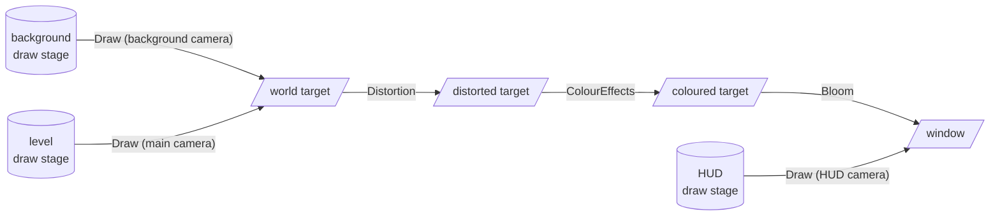

# The render queue and render stages

Each frame, [Rendering()](xref:Yak2D.IApplication.Rendering*) builds a **render queue**: the ordered list of GPU operations that produces the frame. Every call you make on the [IRenderQueue](xref:Yak2D.IRenderQueue) (`q`) adds one step. When `Rendering()` returns, yak2D runs the steps in order.

## What can go in the queue

| Call | Does |
|---|---|
| [ClearColour(target, colour)](xref:Yak2D.IRenderQueue.ClearColour*) | Fill a render target with a colour. |
| [ClearDepth(target)](xref:Yak2D.IRenderQueue.ClearDepth*) | Reset a render target's depth buffer. |
| [Draw(drawStage, camera, target)](xref:Yak2D.IRenderQueue.Draw*) | Render a [draw stage](drawing.md) through a 2D camera. |
| [Copy(source, target)](xref:Yak2D.IRenderQueue.Copy*) | Copy (and stretch) one surface onto another. |
| [ColourEffects(stage, source, target)](xref:Yak2D.IRenderQueue.ColourEffects*) | [Colour effects](effects.md#colour-effects). |
| [Bloom(stage, source, target)](xref:Yak2D.IRenderQueue.Bloom*) | [Bloom](effects.md#bloom). |
| [Blur(stage, source, target)](xref:Yak2D.IRenderQueue.Blur*), [Blur1D(...)](xref:Yak2D.IRenderQueue.Blur1D*) | [Blur](effects.md#blur). |
| [StyleEffects(stage, source, target)](xref:Yak2D.IRenderQueue.StyleEffects*) | [Style effects](effects.md#style-effects). |
| [Mix(stage, mix, t0, t1, t2, t3, target)](xref:Yak2D.IRenderQueue.Mix*) | [Mix](effects.md#mix) up to four surfaces. |
| [Distortion(stage, camera, source, target)](xref:Yak2D.IRenderQueue.Distortion*) | [Distortion](distortion.md). |
| [MeshRender(stage, camera3D, source, target)](xref:Yak2D.IRenderQueue.MeshRender*) | [3D mesh](mesh.md). |
| [CustomShader(stage, t0, t1, t2, t3, target)](xref:Yak2D.IRenderQueue.CustomShader*) | Your own [shader](customshaders.md). |
| [CustomVeldrid(stage, t0, t1, t2, t3, target)](xref:Yak2D.IRenderQueue.CustomVeldrid*) | Your own [NeoVeldrid code](customveldrid.md). |
| [CopySurfaceData(stage, source)](xref:Yak2D.IRenderQueue.CopySurfaceData*) | [Copy pixels back to the CPU](readback.md). |
| [SetViewport(viewport)](xref:Yak2D.IRenderQueue.SetViewport*), [RemoveViewport()](xref:Yak2D.IRenderQueue.RemoveViewport) | Limit the following steps to part of the surface ([viewports](viewports.md)). |

## Building a pipeline

The pattern is always the same: each step reads one or more surfaces and writes to a render target. Chaining steps through render targets builds up a pipeline. This is the one from the [Yak Run tutorial](../tutorials/yakrun-4.md):

[!code-csharp]

A few rules to keep in mind:

- **Order matters.** Steps run in the order you add them. A step sees everything earlier steps rendered into its source.
- **Don't read and write the same surface in one step.** Use two render targets and go back and forth between them if you need several effects in a row.
- **Effect stages fill the whole target** (or the whole viewport), stretching their source to fit.
- **Clear what you need.** Render targets with auto-clear on start each frame empty; the window and other surfaces only change when you clear or render onto them. Clear depth between draw stages rendered to the same target when the second should be on top (see [Drawing](drawing.md#depth-between-draw-stages)).

## Render stages

Everything except clears, copies and viewports is done by a **render stage**. Stages are [resources](resources.md): create them once in `CreateResources()` with `yak.Stages.Create...Stage()`, then use them every frame.

| Stage | Create with | Configure with |
|---|---|---|
| [Draw](drawing.md) | [CreateDrawStage()](xref:Yak2D.IStages.CreateDrawStage*) | draw requests each frame |
| [Colour effects](effects.md#colour-effects) | [CreateColourEffectsStage()](xref:Yak2D.IStages.CreateColourEffectsStage) | [SetColourEffectsConfig()](xref:Yak2D.IStages.SetColourEffectsConfig*) |
| [Bloom](effects.md#bloom) | [CreateBloomStage()](xref:Yak2D.IStages.CreateBloomStage*) | [SetBloomConfig()](xref:Yak2D.IStages.SetBloomConfig*) |
| [Blur](effects.md#blur) | [CreateBlurStage()](xref:Yak2D.IStages.CreateBlurStage*) | [SetBlurConfig()](xref:Yak2D.IStages.SetBlurConfig*) |
| [Blur1D](effects.md#blur) | [CreateBlur1DStage()](xref:Yak2D.IStages.CreateBlur1DStage*) | [SetBlur1DConfig()](xref:Yak2D.IStages.SetBlur1DConfig*) |
| [Style effects](effects.md#style-effects) | [CreateStyleEffectsStage()](xref:Yak2D.IStages.CreateStyleEffectsStage) | `SetStyleEffects...Config()` |
| [Mix](effects.md#mix) | [CreateMixStage()](xref:Yak2D.IStages.CreateMixStage) | [SetMixStageProperties()](xref:Yak2D.IStages.SetMixStageProperties*) |
| [Distortion](distortion.md) | [CreateDistortionStage()](xref:Yak2D.IStages.CreateDistortionStage*) | [SetDistortionConfig()](xref:Yak2D.IStages.SetDistortionConfig*) + height map drawing |
| [Mesh render](mesh.md) | [CreateMeshRenderStage()](xref:Yak2D.IStages.CreateMeshRenderStage) | `SetMeshRender...()` |
| [Custom shader](customshaders.md) | [CreateCustomShaderStage()](xref:Yak2D.IStages.CreateCustomShaderStage*) | [SetCustomShaderUniformValues()](xref:Yak2D.IStages.SetCustomShaderUniformValues*) |
| [Custom Veldrid](customveldrid.md) | [CreateCustomVeldridStage()](xref:Yak2D.IStages.CreateCustomVeldridStage*) | your own code |
| [Surface copy](readback.md) | [CreateSurfaceCopyDataStage()](xref:Yak2D.IStages.CreateSurfaceCopyDataStage*) | [SetSurfaceCopyDataStageCallback()](xref:Yak2D.IStages.SetSurfaceCopyDataStageCallback*) |

### One configuration per stage per frame

A stage has a single configuration, and it applies to every use of that stage within a frame. If you want the same effect twice in one frame with different settings (say, a light blur and a heavy blur), create **two stages**. Stages are cheap.

### Smooth transitions

Most `Set...Config()` methods take an optional `transitionSeconds`. Instead of switching at once, the stage blends from its current settings to the new ones over that time. Fades, flashes and gradual changes need no code of your own:

[!code-csharp]

Yak Run uses this to fade the world to grey when the yak falls, and back again when it reappears.

### Destroying stages

[DestroyStage()](xref:Yak2D.IStages.DestroyStage*) destroys one stage; [DestroyAllStages()](xref:Yak2D.IStages.DestroyAllStages) destroys them all. [CountRenderStages](xref:Yak2D.IStages.CountRenderStages) tells you how many exist.

## See also

- [Surfaces and render targets](surfaces.md)
- [Post-processing effects](effects.md)
- Sample: [DrawingAndEffects_PrerenderingTexturesForUseLater](https://github.com/AlzPatz/yak2d-samples/tree/master/src/DrawingAndEffects_PrerenderingTexturesForUseLater) chains several stages to pre-render an animation
