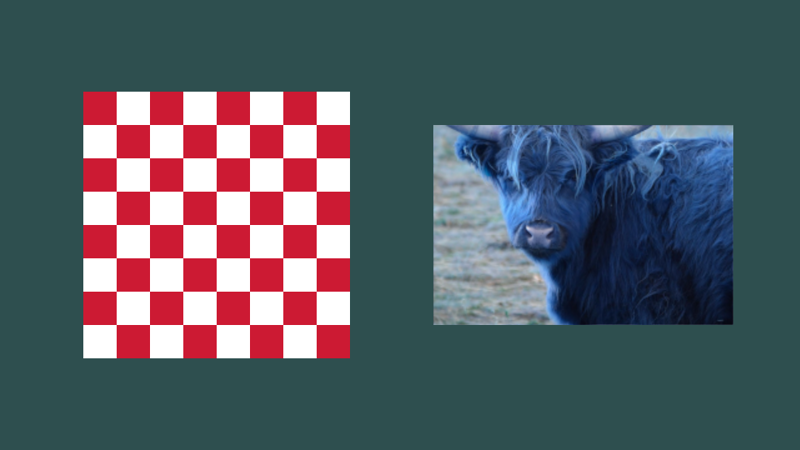
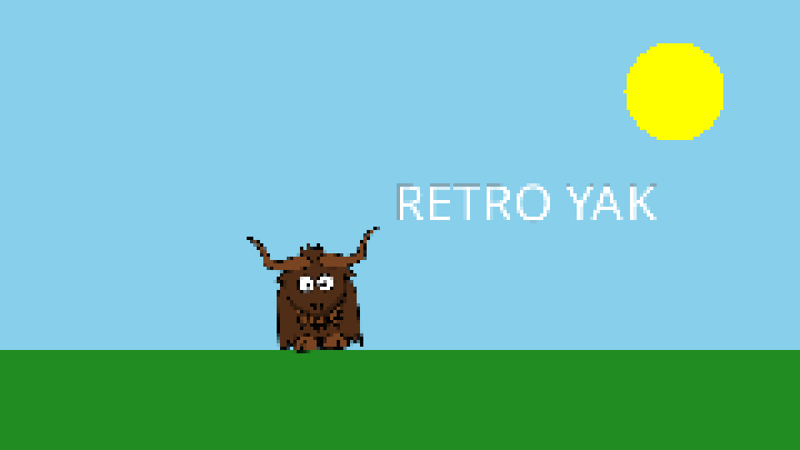

# Surfaces: textures and render targets

A **surface** is an image stored on the GPU. There are two kinds:

| | [Texture](xref:Yak2D.ITexture) | [Render target](xref:Yak2D.IRenderTarget) |
|---|---|---|
| Can be **read** (drawn as a sprite, used as an effect's input) | yes | yes |
| Can be **rendered onto** | no | yes |
| Has a depth buffer | no | yes |
| Made by | loading an image, or from pixel data | [CreateRenderTarget()](xref:Yak2D.ISurfaces.CreateRenderTarget*) |

An [IRenderTarget](xref:Yak2D.IRenderTarget) is also an [ITexture](xref:Yak2D.ITexture), so anywhere a texture is expected you can pass a render target. That is what makes multi-step rendering possible: render something onto a render target, then use it as the input to the next step.

The **window** is a render target too. It is passed to [Rendering()](xref:Yak2D.IApplication.Rendering*) as `windowRenderTarget`, and can also be fetched with [ReturnMainWindowRenderTarget()](xref:Yak2D.ISurfaces.ReturnMainWindowRenderTarget). (The window's render target cannot be read from, though, only rendered onto.)

## Textures

Load textures from image files (see [Assets](assets.md)) or from a `Stream`:

```csharp
var texture = yak.Surfaces.LoadTexture("yak", AssetSourceEnum.Embedded);
using var stream = File.OpenRead("screenshot.png");
var fromStream = yak.Surfaces.LoadTexture(stream);
```

### Textures from data

Textures can also be made from pixel data in code. [CreateRgbaFromData()](xref:Yak2D.ISurfaces.CreateRgbaFromData*) takes one `Vector4` per pixel (red, green, blue, alpha, each 0 to 1), row by row from the top-left. [LoadTextureColourData()](xref:Yak2D.ISurfaces.LoadTextureColourData*) loads an image's pixels into a [TextureData](xref:Yak2D.TextureData) without creating a texture, so you can inspect or change them first:



[!code-csharp[](../code/Snippets/Surfaces.cs#texture-from-data)]

[CreateFloat32FromData()](xref:Yak2D.ISurfaces.CreateFloat32FromData*) makes a single-channel texture of `float` values, which is what the [distortion](distortion.md) stage uses for height maps.

### Texture size

[GetSurfaceDimensions()](xref:Yak2D.ISurfaces.GetSurfaceDimensions*) returns a surface's width and height in pixels as a `System.Drawing.Size`. It is handy for drawing a sprite at its natural size, or keeping its aspect ratio.

## Render targets

```csharp
_scene = yak.Surfaces.CreateRenderTarget(960, 540);
```

[CreateRenderTarget()](xref:Yak2D.ISurfaces.CreateRenderTarget*) takes a width and height in pixels, and optionally:

- **autoClearColourAndDepthEachFrame** (default `true`): clears the render target to transparent black, and its depth buffer, at the start of every frame. Leave it on unless you want to keep what was drawn last frame (for trails, paint programs, or pre-rendered textures).
- **samplerType** (default `Anisotropic`): how the render target is filtered when it is later read and drawn at a different size. `Point` gives crisp pixels.
- **numberOfMipMapLevels** (default 1, meaning none).

Render into it with any stage, and read from it in a later step:

```csharp
q.Draw(_drawStage, _camera, _scene);          // render the scene off-screen
q.Blur(_blur, _scene, windowRenderTarget);    // then use it as the input to an effect
```

### Example: a retro, low-resolution look

Rendering into a small render target with point sampling, then copying it to the window, gives chunky pixels without changing any drawing code:



[!code-csharp[](../code/Snippets/Surfaces.cs#pixelart-resources)]

[!code-csharp[](../code/Snippets/Surfaces.cs#pixelart-rendering)]

### Other uses

- **Post-processing**: render the scene into a render target, then pass it through [effects](effects.md) on its way to the window.
- **Pre-rendering**: draw something expensive once into a render target (with auto-clear off) and then draw that as a simple textured quad every frame. The [DrawingAndEffects_PrerenderingTexturesForUseLater](https://github.com/AlzPatz/yak2d-samples/tree/master/src/DrawingAndEffects_PrerenderingTexturesForUseLater) sample pre-renders an animated explosion this way.
- **Picture-in-picture**: render a second view into a render target and draw it as a sprite.
- **Textures for 3D**: use a render target as the texture on a [3D mesh](mesh.md).
- **Reading pixels back**: render into a render target, then [copy it to the CPU](readback.md).

## Clearing

[q.ClearColour(target, colour)](xref:Yak2D.IRenderQueue.ClearColour*) fills a render target with a colour; [q.ClearDepth(target)](xref:Yak2D.IRenderQueue.ClearDepth*) resets its depth buffer. Render targets created with auto-clear on (and the window, if the [configuration](configuration.md) asks for it) are cleared automatically at the start of every frame, before your render queue runs.

## Copying

[q.Copy(source, target)](xref:Yak2D.IRenderQueue.Copy*) copies any surface onto a render target, stretching it to fit. The sizes do not need to match.

## Destroying surfaces

[DestroySurface()](xref:Yak2D.ISurfaces.DestroySurface*) destroys one texture or render target. [DestroyAllUserTextures()](xref:Yak2D.ISurfaces.DestroyAllUserTextures), [DestroyAllUserRenderTargets()](xref:Yak2D.ISurfaces.DestroyAllUserRenderTargets) and [DestoryAllUserSurfaces()](xref:Yak2D.ISurfaces.DestoryAllUserSurfaces) (note the spelling) destroy many at once. See [Resources and references](resources.md).

## See also

- Samples: [Surfaces_CreateTextureFromDataRGBA](https://github.com/AlzPatz/yak2d-samples/tree/master/src/Surfaces_CreateTextureFromDataRGBA), [Draw_ImageFileFormats](https://github.com/AlzPatz/yak2d-samples/tree/master/src/Draw_ImageFileFormats), [Copy_Example](https://github.com/AlzPatz/yak2d-samples/tree/master/src/Copy_Example)
- Full example code: [Surfaces.cs](https://github.com/AlzPatz/yak2d-docs-content/blob/master/code/Snippets/Surfaces.cs)
