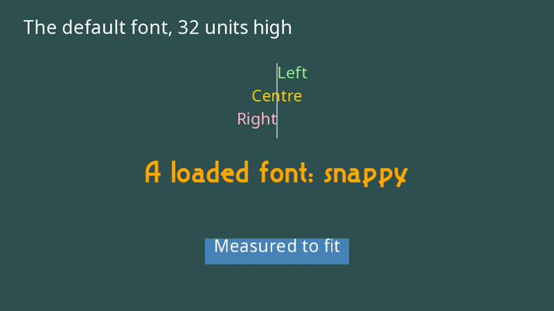

# Text

yak2D draws text with **bitmap fonts**: each character is a small image, and a string is drawn as a row of textured rectangles on a [draw stage](drawing.md). A font is built in, and you can load your own.



## Drawing a string

[DrawString()](xref:Yak2D.IDrawing.DrawString*) submits a string to a draw stage, like any other drawing:

[!code-csharp[](../code/Snippets/TextAndCameras.cs#text-drawing)]

| Parameter | Meaning |
|---|---|
| `stage` | The draw stage to add the text to. |
| `target` | `CoordinateSpace.Screen` for HUDs and menus, `World` for labels that move with the world. |
| `text` | The string. `\n` starts a new line; `\t` moves on by one font size. |
| `colour` | The text colour. |
| `fontSize` | The height of the text, in the same units as everything else (screen or world units, not pixels). |
| `position` | Where the text goes. **Y is the top of the text.** X is the left edge, centre or right edge, depending on `justify`. |
| `justify` | [TextJustify](xref:Yak2D.TextJustify): `Left`, `Centre` or `Right`. |
| `depth`, `layer` | Drawing order, as for any draw request. Give text a lower depth or higher layer than whatever it sits on. |
| `font` | An [IFont](xref:Yak2D.IFont) you loaded, or leave it out (or `null`) for the built-in font. |
| `useKerningsWhereAvaliable` | Use the font's kerning information (spacing between particular pairs of letters) if it has any. |

Characters that the font does not contain are drawn as `?`.

> [!NOTE]
> Centre and right justification measure the whole string, so for text with several lines (`\n`), only left justification lines every row up correctly. For centred multi-line text, draw each line separately.

## Measuring text

[MeasureStringLength()](xref:Yak2D.IDrawing.MeasureStringLength*) returns how wide a string will be at a given size (the same method is on [IFonts](xref:Yak2D.IFonts.MeasureStringLength*)). Use it to fit boxes round text, or to lay out text yourself.

## The built-in font

When no font is given, yak2D uses its built-in font, **Noto Sans**, which has bitmap sizes from 6 to 256. Whatever size you ask for, the nearest bitmap size is used and scaled, so it stays sharp at any size.

## Loading your own fonts

yak2D reads fonts in the **AngelCode BMFont** text format: a `.fnt` description file plus one or more `.png` "page" images containing the characters. Many free tools produce this format:

- [BMFont](https://www.angelcode.com/products/bmfont/) (Windows), the original.
- [Hiero](https://libgdx.com/wiki/tools/hiero) (Java, runs anywhere).
- [SnowB BMF](https://snowb.org/) (in the browser).

Choose the **text** `.fnt` format (not XML or binary) and **PNG** pages.

A font can have several sizes, each with its own `.fnt` file. Name the files `<name>_<size>.fnt` and put them, with their page images, in your [font folder](assets.md):

```text
Fonts/
├── snappy_38.fnt
├── snappy_38_0.png
├── snappy_38_1.png
├── snappy_64.fnt
├── snappy_64_0.png
└── ...
```

Then load the whole family by its name:

[!code-csharp[](../code/Snippets/TextAndCameras.cs#text-resources)]

[LoadFont()](xref:Yak2D.IFonts.LoadFont*) loads every `.fnt` file whose name starts with the name you give, plus the page images each one refers to. When drawing, the size closest to the requested size is used. Include a larger size if you draw text big, as scaling a small bitmap up makes it blurry.

> [!WARNING]
> Font file names must not contain spaces. If no matching `.fnt` files can be found, `LoadFont()` throws a [Yak2DException](xref:Yak2D.Yak2DException). Embedded fonts are affected by the same [assembly name rule](assets.md#embedding-assets) as textures.

Fonts are resources: load them in `CreateResources()`, and destroy them with [IFonts.DestroyFont()](xref:Yak2D.IFonts.DestroyFont*) if you no longer need them.

## Tips

- For a HUD, use a separate draw stage and a camera that never moves, rendered after the game with a depth clear in between (as the [Yak Run tutorial](../tutorials/yakrun-3.md) does).
- Each character is one draw request. Hundreds of strings per frame are fine; for very large amounts of static text, consider drawing it once to a [render target](surfaces.md) and drawing that as a texture.
- Text is ordinary drawing, so it can be rotated by the camera, have effects applied, and so on.

## See also

- Sample: [Draw_FontExample](https://github.com/AlzPatz/yak2d-samples/tree/master/src/Draw_FontExample)
- Full example code: [TextAndCameras.cs](https://github.com/AlzPatz/yak2d-docs-content/blob/master/code/Snippets/TextAndCameras.cs) (`TextExample`)
