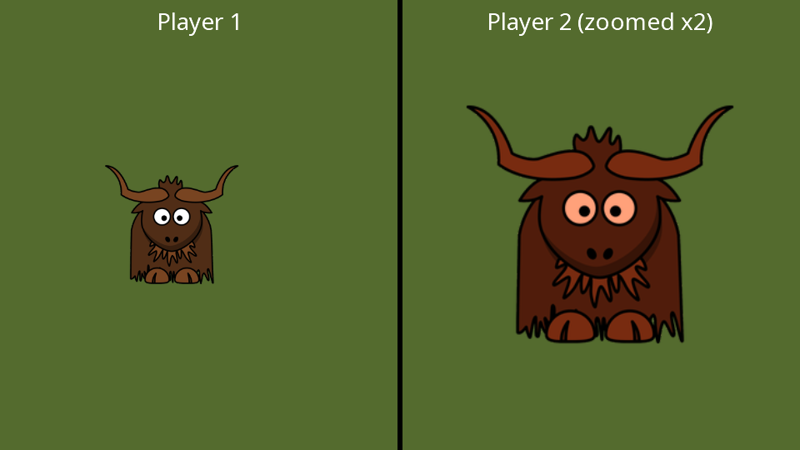

# Viewports

A **viewport** ([IViewport](xref:Yak2D.IViewport)) restricts rendering to a rectangle of a surface. Whatever a render stage would normally draw across the whole surface is drawn into the rectangle instead. That makes split-screen games, picture-in-picture views, mini-maps and side-by-side comparisons straightforward.

## Creating viewports

Viewports are created in pixels, measured from the **top-left** corner of the surface (see [window space](coordinatesystems.md#window-space)):

[!code-csharp]

[CreateViewport(x, y, width, height)](xref:Yak2D.IStages.CreateViewport*) takes the left edge, the top edge, the width and the height.

## Using viewports

In the render queue, [SetViewport()](xref:Yak2D.IRenderQueue.SetViewport*) applies a viewport to every operation that follows, until another is set or [RemoveViewport()](xref:Yak2D.IRenderQueue.RemoveViewport) returns to the whole surface:

[!code-csharp]

The viewport is reset at the start of each frame, so every frame starts drawing to whole surfaces.

Viewports work with every render stage, not only draw stages. The effect examples in these docs use them to show several effects side by side in one window (see [Post-processing effects](effects.md)).

## Viewports and cameras

A camera's view is stretched to fill the viewport. In the example above, each half of the window is 480 x 540 pixels, so each camera is given a 480 x 540 virtual resolution to keep the picture in proportion.

## Viewports and window size

Unlike cameras, viewports are in real pixels, so they do not adapt when the window size changes. If your window can be resized or made fullscreen, recreate your viewports when you receive the `SwapChainFramebufferReCreated` [message](lifecycle.md#framework-messages) (destroy the old ones with [DestroyViewport()](xref:Yak2D.IStages.DestroyViewport*)), using the new size from [IDisplay](xref:Yak2D.IDisplay) or [ISurfaces.GetSurfaceDimensions()](xref:Yak2D.ISurfaces.GetSurfaceDimensions*).

An alternative that avoids this entirely: render each view into its own fixed-size [render target](surfaces.md), and draw those render targets as textured quads in a single screen-space draw stage.

## See also

- Samples: [Draw_SplitScreenExample](https://github.com/AlzPatz/yak2d-samples/tree/master/src/Draw_SplitScreenExample), [Window_ChangingWindowProperties](https://github.com/AlzPatz/yak2d-samples/tree/master/src/Window_ChangingWindowProperties)
- Full example code: [TextAndCameras.cs](https://github.com/AlzPatz/yak2d-docs-content/blob/master/code/Snippets/TextAndCameras.cs) (`SplitScreen`)
