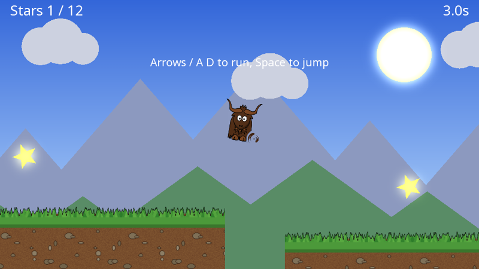

# yak2D

**A small C# framework for making 2D games and graphics applications that run on Windows, Linux and macOS.**

yak2D gives you a window, a game loop, input, and a flexible GPU rendering pipeline, from a single NuGet package with nothing else to install. You write the game in C#; there is no editor, and no engine to fight. Draw sprites, shapes and text, then send your scene through bloom, blur, distortion, CRT and colour effects, your own shaders, or onto 3D meshes, in whatever order you like.

[](https://www.nuget.org/packages/Yak2D/)



## Start here

| Page | What you'll find |
|---|---|
| **[Getting Started](tutorials/gettingstarted.md)** | Install .NET, create a project, open a window. About 10 minutes. |
| **[Yak Run tutorial](tutorials/yakrun-1.md)** | Build the game above, step by step, in four parts. |
| **[How yak2D works](articles/overview.md)** | The few ideas the whole framework is built on. |
| **[Manual](articles/intro.md)** | Every feature, explained with working examples. |
| **[API Reference](api/index.md)** | Every type and method. |
| **[Samples](articles/samples.md)** | ~35 small demo projects, one per feature. |

## A taste

```csharp
using System.Numerics;
using Yak2D;

Launcher.Run(new Hello());
```

[!code-csharp[](code/Snippets/Hello.cs#hello)]

```bash
dotnet new console -n Hello && cd Hello && dotnet add package Yak2D
# put the code above in Program.cs, then:
dotnet run
```

## Features

- **Cross-platform**: Windows, Linux and macOS on Direct3D 11, Vulkan and OpenGL, from one codebase.
- **2D drawing**: sprites, shapes, lines, custom polygons and text, sorted by layer and depth, batched automatically.
- **Cameras**: resolution-independent 2D cameras with zoom and rotation, world and screen space, split screen viewports.
- **Effects**: bloom, blur, colour grading, pixellate, CRT, old movie, static, edge detection, distortion and mixing, chained in any order, with smooth transitions.
- **Beyond the built-ins**: custom GLSL shaders on any API, 3D meshes with lighting, raw NeoVeldrid access, GPU to CPU readback.
- **Input**: keyboard, mouse and gamepads.

[See all features](articles/features.md)

## Source

yak2D is open source under the MIT licence: [github.com/AlzPatz/yak2d](https://github.com/AlzPatz/yak2d). It is built on [NeoVeldrid](https://www.nuget.org/packages/NeoVeldrid), [Silk.NET](https://github.com/dotnet/Silk.NET) and [SDL](https://www.libsdl.org/).
