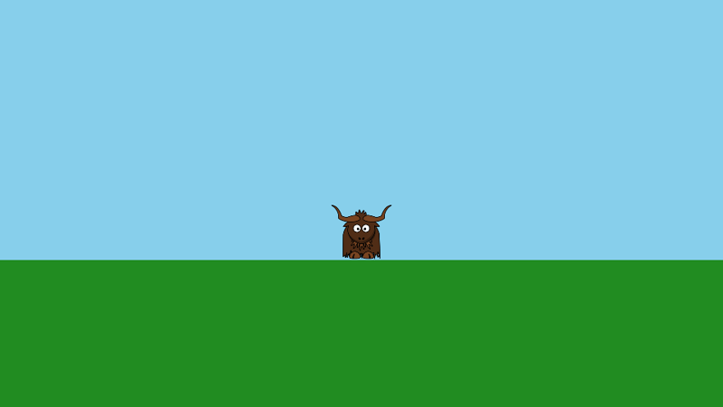

# Yak Run, part 1: a yak on screen

In this four part tutorial you will build **Yak Run**, a small platform game. By the end, a yak runs and jumps across floating platforms, collecting glowing stars on the way to a finishing flag, with scrolling scenery, a HUD and some special effects.


In this first part you will set up the project and draw the yak standing on the ground.



**You will learn:** how to embed textures in a project, and how draw stages, cameras, textured and coloured quads, and depth work.

**Before you start:** complete [Getting Started](gettingstarted.md), so that you have the .NET SDK installed and know how to create and run a yak2D project.

The finished code for each part is in the documentation repository: [Part 1](https://github.com/AlzPatz/yak2d-docs-content/tree/master/code/YakRun/Part1), [Part 2](https://github.com/AlzPatz/yak2d-docs-content/tree/master/code/YakRun/Part2), [Part 3](https://github.com/AlzPatz/yak2d-docs-content/tree/master/code/YakRun/Part3), [Part 4](https://github.com/AlzPatz/yak2d-docs-content/tree/master/code/YakRun/Part4).

## Create the project

```bash
dotnet new console -n YakRun
cd YakRun
dotnet add package Yak2D
```

## Add the yak

Create a folder called `Textures` in the project folder, and save this image into it as `yak.png`:

[](https://github.com/AlzPatz/yak2d-docs-content/raw/master/code/YakRun/Part1/Textures/yak.png)

Now tell .NET to **embed** everything in the `Textures` folder inside the compiled program, so the game is a single, self-contained program that cannot lose its images. Open `YakRun.csproj` and make it look like this:

[!code-xml[](../code/YakRun/Part1/YakRun.csproj)]

Two changes from the template:

- the `EmbeddedResource` item embeds the textures;
- `Nullable` is `disable`. yak2D resources are created in a method called `CreateResources()` rather than in constructors, so C#'s nullable warnings about uninitialised fields would just be noise.

> [!NOTE]
> yak2D finds embedded files by your program's *assembly name*, which is normally the project name. If you give your project a name containing a hyphen (like `yak-run`), also add `<RootNamespace>$(AssemblyName)</RootNamespace>` to the `PropertyGroup`. See [Assets](../articles/assets.md#embedding-assets) for why.

## The Game class

Replace `Program.cs` with:

[!code-csharp[](../code/YakRun/Part1/Program.cs)]

and create `Game.cs`. We will go through it a piece at a time; the whole file is at the end of this page.

### Fields

[!code-csharp[](../code/YakRun/Part1/Game.cs#fields)]

These hold **references** to things yak2D creates for us: a texture, a draw stage and a camera. yak2D owns the real objects (mostly on the GPU); we keep small reference objects to tell it which ones we mean. See [Resources and references](../articles/resources.md).

### Start up

[!code-csharp[](../code/YakRun/Part1/Game.cs#startup)]

`Configure()` is the first method yak2D calls. `StartupConfig.Default()` gives a 960 x 540 window with sensible settings. `OnStartup()` is for setting up our own objects; there are none yet.

### Creating resources

[!code-csharp[](../code/YakRun/Part1/Game.cs#resources)]

Everything yak2D creates is made in `CreateResources()`:

- **`LoadTexture("yak", AssetSourceEnum.Embedded)`** loads `Textures/yak.png` from the embedded files. The name has no folder and no extension.
- **`CreateDrawStage()`** makes a *draw stage*: a collector for everything we want to draw. Each frame we submit shapes and sprites to it; it sorts them and draws them efficiently.
- **`CreateCamera2D(960, 540)`** makes a camera that shows 960 by 540 units. This is its *virtual resolution*: however big the window is, the camera shows the same 960 x 540 area, scaled to fit. Position (0,0) is in the middle, and **+Y is up**.

If the graphics device is ever recreated (for example, if the graphics API is switched), every yak2D resource is lost and yak2D sends a `GraphicsDeviceRecreated` message. Handling it takes one line: call `CreateResources()` again. It is a good habit to start with.

### Update

[!code-csharp[](../code/YakRun/Part1/Game.cs#update)]

`Update()` is called 120 times a second by default. Returning `false` closes the game, so Escape quits. `PreDrawing()` runs just before each frame is drawn; we will use it later.

### Drawing

[!code-csharp[](../code/YakRun/Part1/Game.cs#drawing)]

`Drawing()` runs once per frame. We submit two things to the draw stage:

- **The yak**, with `DrawTexturedQuad`: a rectangle showing a texture. The position is its centre. `Colour.White` leaves the texture's own colours unchanged (any other colour would tint it). The size keeps the image's proportions (the texture is 256 x 228 pixels).
- **The ground**, with `DrawColouredQuad`: a rectangle filled with one colour.

The last number is the **depth**, from 0 (front) to 1 (back). The yak is at 0.5 and the ground at 0.9, so the yak is always drawn in front of the ground, whichever order we submit them in. See [Layers and depth](../articles/drawing.md#layers-and-depth).

`CoordinateSpace.World` means the positions are in the game world, viewed through the camera. When the camera moves (in part 3), these will move on screen.

### Rendering

[!code-csharp[](../code/YakRun/Part1/Game.cs#rendering)]

Nothing we submitted in `Drawing()` has appeared yet. `Rendering()` builds the list of GPU work for the frame:

1. clear the window to sky blue,
2. clear the window's depth buffer, so last frame's depths don't hide this frame's drawing,
3. render our draw stage, through our camera, onto the window.

This split between *drawing* (describing what to draw) and *rendering* (deciding how and where it is rendered) is at the heart of yak2D. In part 4 it lets us send the whole scene through a chain of effects before it reaches the window. See [How yak2D works](../articles/overview.md#drawing-and-rendering-are-two-different-steps).

## Run it

```bash
dotnet run
```

A yak stands on green ground under a blue sky. Press Escape to quit.

> [!TIP]
> Try making the window resizable (`config.WindowIsResizable = true;` in `Configure()`), then resize it. The camera's virtual resolution keeps the picture the same, just scaled.

## The finished code

The complete files for this part are on GitHub: [Game.cs](https://github.com/AlzPatz/yak2d-docs-content/blob/master/code/YakRun/Part1/Game.cs), [Program.cs](https://github.com/AlzPatz/yak2d-docs-content/blob/master/code/YakRun/Part1/Program.cs), [YakRun.csproj](https://github.com/AlzPatz/yak2d-docs-content/blob/master/code/YakRun/Part1/YakRun.csproj). (The `#region` lines in the code only mark the pieces shown on this page.)

## Next

In [part 2](yakrun-2.md) the yak learns to run and jump.
