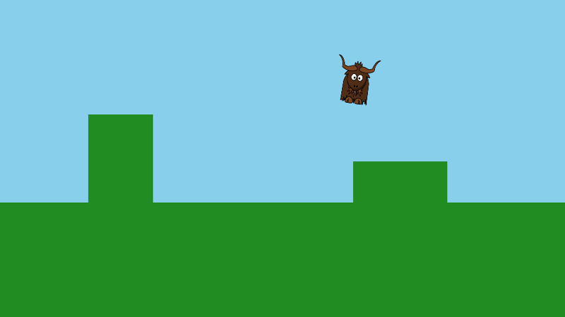

# Yak Run, part 2: running and jumping

In [part 1](yakrun-1.md) the yak stood still. Now it runs, jumps, falls and lands, and bumps into things. Along the way you will see how yak2D's update loop and input work.

**You will learn:** reading the keyboard and gamepads, "held" versus "pressed" input, fixed update steps, simple platform physics with collisions, and animating a sprite by stretching it.

The finished code for this part: [code/YakRun/Part2](https://github.com/AlzPatz/yak2d-docs-content/tree/master/code/YakRun/Part2).

## A box type

Platforms and the yak's collision area are all rectangles, so we start with a small rectangle type. Create `Box.cs`:

[!code-csharp]

Remember that in yak2D's world space **+Y is up**, so a box's `Bottom` is its smaller Y value. `Overlaps` uses `<` and `>` rather than `<=` and `>=`, so a yak standing exactly on top of a platform is touching it, but not overlapping it.

## The Yak class

Create `Yak.cs`. The yak has a position, a velocity, and a few tuning numbers.

### Tuning

[!code-csharp]

Positions are in world units, which at the camera's zoom of 1 are the same size as screen pixels in a 960 x 540 window. Speeds are in units per second, and accelerations in units per second per second. These numbers are simply what felt good: try changing them.

### State

[!code-csharp]

`Position` is the centre of the yak's collision box. It is a *field* rather than a property so that `Position.X += ...` works on the `Vector2` directly.

### Moving

[!code-csharp]

This runs once per update step. `seconds` is the length of the step, so multiplying every speed and acceleration by it makes the yak move at the same real-world speed whatever the step length.

1. **Horizontal speed** eases towards the target (`moveInput * RunSpeed`) at a fixed rate, so the yak takes a moment to get going and to stop.
2. **Jumping** only works when standing on something: it sets an upward velocity.
3. **Gravity** pulls the velocity down every step, up to a maximum falling speed.
4. **Collisions** are handled one axis at a time. First the yak moves horizontally; if it now overlaps a platform, it is pushed back to the platform's side. Then it moves vertically; if it overlaps, it is pushed out above (it has landed) or below (it bumped its head). Handling the axes separately means the yak slides neatly along floors and walls.

> [!NOTE]
> By default yak2D runs updates at a **fixed** 120 steps per second, independently of how fast frames are drawn. Physics like this behaves identically on every computer. yak2D may occasionally run one shorter step just before a frame is drawn, to keep motion smooth, which is another reason to always use the `seconds` value you are given. See [Application lifecycle: Update timing](../articles/lifecycle.md#update-timing).

### Drawing

[!code-csharp]

The yak is one still image, but a little squash and stretch makes it feel alive:

- While running, a sine wave bobs its width and height in opposite directions, so it looks like it is bounding along.
- In the air it is stretched tall and thin.
- It leans in the direction it is moving, using the quad's `rotation_clockwise_radians`.

Because the height changes, the sprite's centre is moved so its feet stay on the bottom of the collision box. The yak is drawn on **layer 2**, which will keep it in front of the level we build in part 3.

## Changes to Game.cs

### Fields and start up

[!code-csharp]

[!code-csharp]

The platforms are plain C# data: the ground and two blocks to jump on. The `Yak` is created in `OnStartup()`. Game objects like these are ordinary C# objects, not yak2D resources, so they survive a graphics device reset untouched.

### Reading the controls

[!code-csharp]

yak2D's input service can answer three questions about each key or button:

| Method | True for | Used for |
|---|---|---|
| `IsKeyCurrentlyPressed` | every update while the key is down | running |
| `WasKeyPressedThisFrame` | only the first update after it goes down | jumping |
| `WasKeyReleasedThisFrame` | only the first update after it comes up | |

Using "pressed this frame" for jumping means holding space makes one jump, not a jump every time the yak lands.

Gamepads work the same way, using an id for each connected pad. The left stick's X axis gives a value from -1 to 1, so a gentle push makes a gentle run. Values near zero are ignored, because sticks rarely rest exactly at zero.

> [!IMPORTANT]
> "This frame" means *this update step*. Always check pressed and released in `Update()`, not in `Drawing()`. See [Input](../articles/input.md).

### Drawing

[!code-csharp]

The platforms are drawn as green rectangles, from the same `Box` data used for collisions, and then the yak draws itself.

## Run it

Arrow keys (or A and D) to run, space (or up, or W) to jump. Jump onto both blocks, and try walking into the tall one.

> [!TIP]
> Try making the yak float like it is on the moon (lower `Gravity`), or turn it into a speed demon (raise `RunSpeed`). What happens if `Acceleration` is very low?

## Next

In [part 3](yakrun-3.md) we build a proper level with scenery, a camera that follows the yak, stars to collect and a finishing line.
