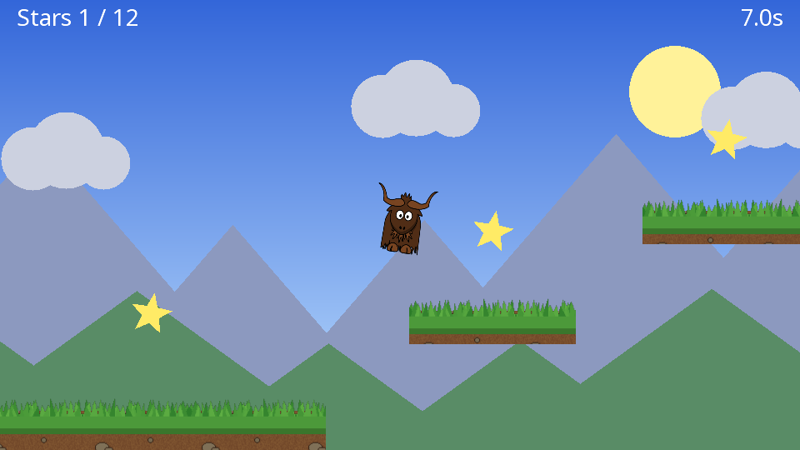
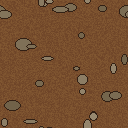

# Yak Run, part 3: building a level

The yak can run and jump; now it needs somewhere to go. In this part you will build a long, scrolling level of grassy platforms, with distant scenery, stars to collect, a finishing flag and an on-screen display.

**You will learn:** tiled textures, custom polygons, drawing from raw draw requests with per-vertex colours, world space versus screen space, a camera that follows the player, parallax scrolling with a second camera, drawing text, and rendering several draw stages on top of each other.

The finished code for this part: [code/YakRun/Part3](https://github.com/AlzPatz/yak2d-docs-content/tree/master/code/YakRun/Part3). `Box.cs` and `Yak.cs` are unchanged from part 2.

## New textures

Save these into the `Textures` folder as `grass.png` and `soil.png`. Both are designed to **tile**: their left and right edges (and, for the soil, top and bottom) join up seamlessly.

 &nbsp; 

## The level

Create `Level.cs`. It starts with a tiny class for a star, which just needs a position and whether it has been collected:

[!code-csharp]

The level itself is just data: platforms, stars, a start point and a flag.

[!code-csharp]

The platforms are laid out so every gap can be jumped. (The yak jumps about 190 units high and about 300 units across.)

### Drawing the level

[!code-csharp]

There is a lot of yak2D in these few methods:

**Tiled platforms.** Each platform is two textured quads: soil for the body and a strip of grass along the top. Normally texture coordinates run from 0 to 1 across a quad, showing the texture once. Going beyond 1 repeats it. The soil texture is 128 pixels square, so setting the maximum texture coordinate to `width / 128` repeats it once every 128 units, however big the platform. See [Texture coordinates](../articles/drawing.md#texture-coordinates-wrapping-and-filtering).

**Wrap versus Mirror.** The soil uses `TextureCoordinateMode.Wrap` (repeat). The grass uses `Mirror`, which flips every other copy. That makes no visible difference to random grass, but it stops the bottom row of the image bleeding into the transparent top edge, which `Wrap` would otherwise show as a thin line above the grass.

**Depth within a layer.** The grass (depth 0.7) is in front of the soil (0.8), and stars (0.4) and the flag (0.6) are in front of both. Everything in the level is on layer 1, behind the yak on layer 2.

**Custom polygons.** The stars are built from our own points: ten round the outside, alternating long and short, plus one in the middle, joined into ten triangles by the index list. `Construct().Coloured(...).Poly(vertices, indices).Filled()` turns them into something drawable. See [The fluent shape builder](../articles/drawing.md#the-fluent-shape-builder).

**Helpers for the rest.** The flag's pole is a `DrawLine` with rounded ends, and the flag itself is a three sided `DrawColouredPoly`, squashed and rotated a quarter turn.

## The background

Create `Background.cs`. The scenery behind the level is drawn by its own draw stage, so it can be viewed through its own camera.

### A gradient sky from a raw draw request

[!code-csharp]

The helper functions cover most drawing, but a [DrawRequest](xref:Yak2D.DrawRequest) built by hand gives complete control. This one is a rectangle made of two triangles (six indices into four vertices) with a different colour at each corner. The GPU blends smoothly between vertex colours, so a darker blue at the top fading to a pale blue at the bottom gives a gradient for free.

It is in **screen space**, so it always fills the view exactly, wherever the camera is. The request is built once, in a field initialiser, and submitted every frame.

### Mountains, clouds and a sun

[!code-csharp]

- The **sun** is in screen space too, so it stays in the same place on screen.
- **Mountains and hills** are triangles (three sided polygons) stretched sideways. They are in world space, so they move when the camera moves.
- **Clouds** are three overlapping circles each (a polygon with enough sides looks round).

## A following camera, and parallax

The level is far wider than the screen, so the camera must follow the yak. And to make the scenery look far away, the background camera moves more slowly than the main camera. This is **parallax**. Both happen in `PreDrawing()`, which runs just before each frame is drawn:

[!code-csharp]

- The camera **eases towards** a target point instead of jumping to it. `1 - exp(-6 * seconds)` moves the same fraction of the remaining distance per second at any frame rate.
- It looks a little **ahead** of the yak in the direction it is running, and a little above it, and its height is limited so it doesn't swing up and down too much.
- The background camera is focused on the same point **scaled by 0.3**, so the scenery moves at 30% of the speed of the level.

See [Cameras](../articles/cameras.md).

## Three draw stages, three cameras

The game now draws three groups of things, each seen through a different camera:

[!code-csharp]

| Draw stage | Camera | Contents |
|---|---|---|
| `_backgroundStage` | `_backgroundCamera`, moving slowly | sky, sun, mountains, clouds |
| `_levelStage` | `_camera`, following the yak | platforms, stars, flag, yak |
| `_hudStage` | `_hudCamera`, never moves | score, time, messages |

Game state now lives in several fields, and `Restart()` puts it back to the beginning:

[!code-csharp]

[!code-csharp]

## Game rules

[!code-csharp]

Each update the yak moves using the level's platforms, then the rules are checked:

- Standing on something remembers a **safe position**. Falling below the level's `FallLimit` puts the yak back there.
- Touching a **star** collects it.
- Passing the **flag** finishes the level: the controls stop and the clock stops.
- **R** restarts.

## The HUD

[!code-csharp]

Text is drawn with `DrawString`, which submits one textured quad per letter to a draw stage, using yak2D's built-in font. The HUD is in **screen space**: (0,0) is the middle of the screen, the edges are at plus and minus 480 across and 270 up and down, and **the position given is the top of the text**. `TextJustify` sets whether the x position is the left edge, centre or right edge. See [Text](../articles/text.md).

## Rendering the stages on top of each other

[!code-csharp]

All three stages are rendered onto the window, in order. Between them, the depth buffer is cleared. Depth values written by one stage stay in the depth buffer and are tested against by the next stage, so without the clears, something in the background could hide something in the level. Clearing depth between stages means each is simply drawn on top of the one before. See [Depth between draw stages](../articles/drawing.md#depth-between-draw-stages).

The sky covers the whole window, so we no longer need to clear the window's colour.

## Run it

Run to the flag, collecting as many stars as you can. Fall off, and you are put back where you last stood.

> [!TIP]
> Try designing your own level by editing `Platforms` and `Stars`. Or add a second row of mountains with a parallax factor of 0.15, drawn behind the first (with a greater depth) by another camera.

## Next

The game works. In [part 4](yakrun-4.md) it gets some polish: glowing stars, ripples when you collect them, and a fade to grey when you fall.
