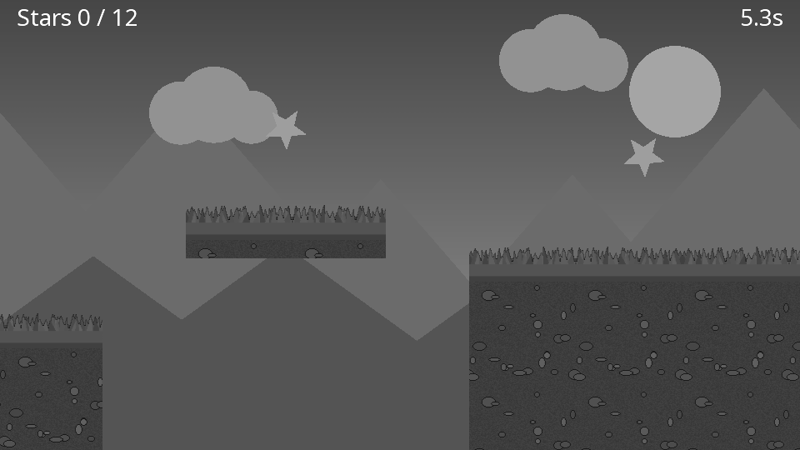
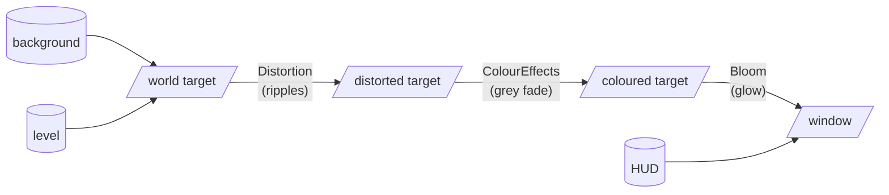
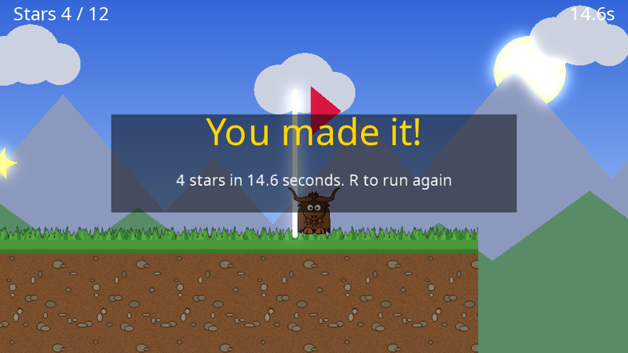

# Yak Run, part 4: effects and polish

The game from [part 3](yakrun-3.md) is complete, but plain. In this final part the whole scene goes through a chain of GPU effects on its way to the screen: the stars and sun **glow**, collecting a star sends out a **ripple**, and falling off the level **fades the world to grey**. The HUD stays crisp on top of it all.

**You will learn:** render targets, building a post-processing pipeline, bloom, distortion and the distortion helpers, colour effects with smooth transitions, and resizable windows.

The finished code for this part: [code/YakRun/Part4](https://github.com/AlzPatz/yak2d-docs-content/tree/master/code/YakRun/Part4). Only `Game.cs` changes.

## The idea: render into surfaces, not the window

So far every draw stage has been rendered straight onto the window. But a render stage can render onto any **render target**: an off-screen image on the GPU. And a render target can then be the *input* to another stage. By rendering the scene into a render target, then passing it through effect stages, each reading one surface and writing the next, we can transform the whole picture:

See [Surfaces and render targets](../articles/surfaces.md) and [The render queue and render stages](../articles/renderstages.md).

## New fields

[!code-csharp]

Three render targets, three effect stages, a texture for the ripples and a helper to manage them, plus a timer for respawning.

## Creating the effects

`CreateResources()` now ends with a call to `CreateEffects()`:

[!code-csharp]

**Render targets.** Each is 960 x 540, the same as the cameras' virtual resolution. By default a render target clears itself at the start of every frame.

**Distortion.** A distortion stage bends its input image according to a *height map* that we draw into it each frame, a bit like looking through rippling water. `ConcentricSinusoidalFloat32` generates a height map texture of rings, and a *distortion collection* animates copies of it: each one grows, moves and fades over its lifetime. See [Distortion](../articles/distortion.md).

**Colour effects.** A colour effects stage can grey, tint, fade or invert its input. We keep two configurations: `NormalColours` (no change: note `Opacity` must be 1) and `FallenColours` (fully grey, and darkened by blending 30% towards black). See [Colour effects](../articles/effects.md#colour-effects).

**Bloom.** Bloom makes bright areas glow. Only pixels brighter than the threshold take part, using *luminance* (how bright a colour looks to us). The stars' pale yellow and the sun are brighter than 0.86; the slightly grey clouds are not, so they do not glow. See [Bloom](../articles/effects.md#bloom).

## Triggering the effects

The update code gains two effect triggers:

[!code-csharp]

**Collecting a star** adds a ripple to the collection, at the star's position in world space: it grows from nothing to 400 units wide while its intensity fades from 1 to 0, over 0.8 seconds, and is then removed automatically.

**Falling** switches the colour stage to `FallenColours` with a **transition** of 0.25 seconds: rather than changing instantly, the stage blends smoothly from its current settings to the new ones. After 0.6 seconds the yak reappears and the colours blend back over half a second. There is no animation code of our own at all. See [Smooth transitions](../articles/renderstages.md#smooth-transitions).

The ripples are advanced in `PreDrawing()`, and submitted to the distortion stage in `Drawing()`:

[!code-csharp]

[!code-csharp]

## The pipeline

[!code-csharp]

Read it from top to bottom:

1. The background and level stages are rendered into `_worldTarget` (with a depth clear between, as before).
2. **Distortion** reads `_worldTarget` and writes the rippled version to `_distortedTarget`. It takes the main camera too, so ripples drawn in world space line up with the stars.
3. **Colour effects** read that and write `_colouredTarget`.
4. **Bloom** reads that and writes to the window.
5. The HUD is drawn on the window last, after a depth clear, so it is unaffected by every effect: it stays white when the world goes grey.

Each step reads one surface and writes a different one. A stage should never read and write the same surface in one step.

## A resizable window

[!code-csharp]

Because the whole scene is rendered at a fixed 960 x 540 and the last step (bloom) stretches it onto the window, the game works at any window size without any other changes. Try resizing the window, or making it fullscreen. (If the window's shape changes, the picture stretches to fill it; see [Cameras](../articles/cameras.md#virtual-resolution) for how to handle that.)

## Run it

## Where next?

You have used most of yak2D's building blocks. Some ideas for taking Yak Run further, and where to look:

- **Enemies and moving platforms**: more game objects with their own `Update()` and `Draw()`, like `Yak`.
- **A title screen and pause menu**: a game state enum, a blurred copy of the game behind the menu ([Blur](../articles/effects.md#blur)), and text.
- **Sprite sheet animation**: several frames in one texture, chosen with texture coordinates ([Drawing](../articles/drawing.md#texture-coordinates-wrapping-and-filtering)).
- **Particles**: many small, short-lived shapes on a draw stage with `BlendState.AdditiveAlpha` ([Blend states](../articles/drawing.md#blend-states)).
- **A retro look**: render the world into a small render target with point sampling ([Surfaces](../articles/surfaces.md#example-a-retro-low-resolution-look)), or add the CRT style effect ([Style effects](../articles/effects.md#style-effects)).
- **Your own effect**: [write a custom shader](customshader.md).
- **Share it**: [distribute your game](distribution.md).
